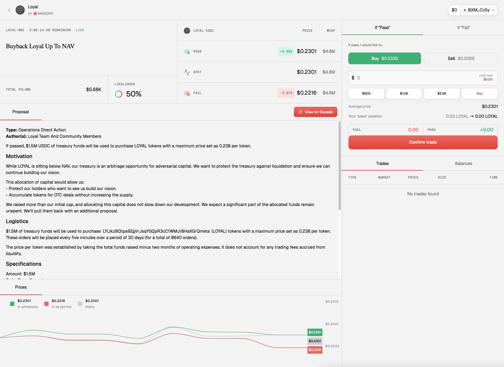
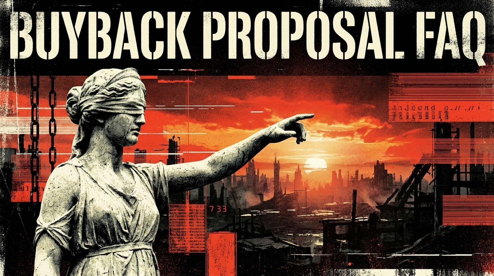

Most DAOs are broken because they use "voting", but voting is free, which means people can lie, larp, or vote for stupid ideas without consequences.

Loyal is different - we use

[@MetaDAOProject](https://x.com/MetaDAOProject)

for governance which means we don't ask you to vote; we ask you to trade in your own best interest.

This system is called "Futarchy." It sounds complex, but it’s actually very simple. It’s based on one rule: Money talks, bullshit walks.

## The Concept: Two Timelines

Imagine you have a time machine that lets you see two different futures:

- Timeline A (PASS): We execute the Buyback plan.

- Timeline B (FAIL): We do not execute the Buyback plan.

In MetaDAO, we create a temporary token for each of these timelines.

1. [$LOYAL-PASS](https://x.com/search?q=%24LOYAL-PASS&src=cashtag_click) (The token price if we say YES)

2. [$LOYAL-FAIL](https://x.com/search?q=%24LOYAL-FAIL&src=cashtag_click) (The token price if we say NO)

*(Note: The same is true of USDC-PASS, and USDC-FAIL.)*

## How to Make Your Voice Heard

You don't cast a ballot. You simply buy the token of the future you believe is more valuable.

If you support the Buyback: You can either buy the PASS token, or sell the FAIL token.

By buying it, you push the price up. You are betting that

[$LOYAL](https://x.com/search?q=%24LOYAL&src=cashtag_click)

will be worth more if we execute this plan.

If you hate the Buyback: You can buy the FAIL token, or sell the PASS token.

In this case you are betting that the plan is a bad idea and

[$LOYAL](https://x.com/search?q=%24LOYAL&src=cashtag_click)

is better off without it.

## How the Winner is Decided

The market runs for 3 days (the Loyal buyback proposal will end just after 21:00 CET on Saturday, November 29th) so we'll be watching the price of both tokens.

- If the PASS token trades at a higher average price than the FAIL token, the proposal executes.

- If the FAIL token is higher, the proposal is rejected.

We don't care how many people like the idea. We care which idea makes the network more valuable.

## The Risk (Your Skin in the Game)

Here is why this system works better than voting: You have to be right.

- Scenario 1: You buy the PASS token. The proposal passes. Your PASS tokens convert into real [$LOYAL](https://x.com/search?q=%24LOYAL&src=cashtag_click) tokens. You kept your position and (hopefully) the price went up because it was a good idea.

- Scenario 2: You buy the PASS token. The proposal FAILS. Your PASS tokens become worthless. You essentially made a bad trade and lost on that specific position.

This forces you to think. You can't just blindly support everything. If you support a bad idea that tanks the price, you lose money. If you support a good idea that raises the value, you profit.

## Step-by-Step Instructions to make your voice count

The Loyal buyback proposal

1. Go to the MetaDAO Proposal Page. ([https://metadao.fi/projects/loyal/proposal/2VjKHNQdkLfHtoH1GtPVseJv1kP3VUoLGcZLc29SttgS](https://metadao.fi/projects/loyal/proposal/2VjKHNQdkLfHtoH1GtPVseJv1kP3VUoLGcZLc29SttgS)).

2. Connect your Solana Wallet.

3. Look at the Markets. You will see a "Pass Market" and a "Fail Market."

4. Make your move.

- Want the buyback? Buy [$LOYAL-PASS](https://x.com/search?q=%24LOYAL-PASS&src=cashtag_click).

- Don't want the buyback? Buy [$LOYAL-FAIL](https://x.com/search?q=%24LOYAL-FAIL&src=cashtag_click).

5.    Wait.

- After 3 days, if your side won, you claim your real tokens.

- If your side lost (e.g., you bought "Pass" but the proposal "Failed"), your prediction was wrong, and those specific conditional tokens go to zero.

## TL;DR:

Stop voting. Start trading.

If you think the Buyback makes Loyal stronger, buy the PASS token.

If you think it makes Loyal weaker, buy the FAIL token.

## FAQ: User questions from the last 24h

Q: Why allocate $1.5M? This seems high?

*A: It sets a soft price floor.*

*We only buy if the price drops below the actual cash value of the treasury. The size is necessary to prevent arbitrage and signal that the DAO will defend its book value against vultures.*

Q: What if the defense fund gets fully spent?

*A: It changes nothing for the roadmap.*

*Our initial raise goal was $500k - we raised significantly more, so even if the full buyback executes, we have ample runway to deliver the stack and grow the network.*

Q: What happens to the money if it isn't used?

*A: The unspent stablecoins sit in the account until a follow-up proposal returns them to the main treasury. If the price respects the math, we spend nothing.*

Q: Is this designed to pump the token price?

*A: No. This creates a floor, not a ceiling.*

*The goal is to stop short-term flippers from exploiting the spread between the price and our cash value.*

Q: Why spread the orders over 30 days?

*A: To prevent volatility. We are using a recurring order (TWAP) to build a stable defense - we aren't trying to spike the chart artificially; we're simply helping the market respect the math.*

Q: Is this replacing the product launch push?

*A: No! This is purely financial hygiene for the DAO treasury.*

*The product ships when the code is attested and ready, and we don't time technology releases based on governance votes.*

Q: What is the buyback cooldown?

*A: Stability.*

*If this proposal passes, the DAO cannot entertain new buyback or redemption proposals for 3 months, which prevents governance spam and keeps the focus on building.*

Q: What's the TL;DR here?

*A: We are placing a soft price floor at 0.238 USDC*

*If the market prices*

[*$LOYAL*](https://x.com/search?q=%24LOYAL&src=cashtag_click)

*below the cash we have in the bank, the DAO buys it back*

*If the price respects the math, we spend nothing - if it doesn't, the DAO absorbs the supply and gets stronger*

Q: How do I vote?

*A: Loyal uses*

[*@MetaDAOProject*](https://x.com/MetaDAOProject)

*(a ‘futarchy’ model) for governance, you can find the proposal linked below:*

***Decide Loyal's most likely path to a higher market cap here:***

[https://metadao.fi/projects/loyal/proposal/2VjKHNQdkLfHtoH1GtPVseJv1kP3VUoLGcZLc29SttgS](https://metadao.fi/projects/loyal/proposal/2VjKHNQdkLfHtoH1GtPVseJv1kP3VUoLGcZLc29SttgS)
