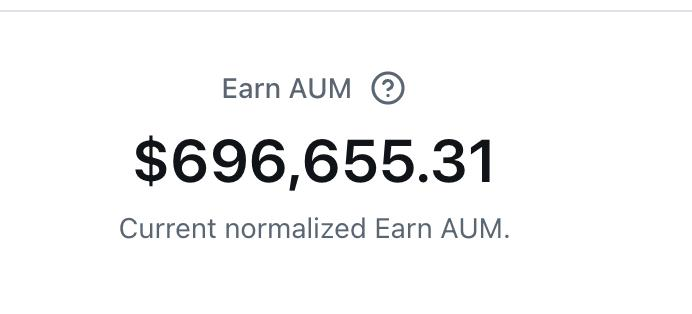
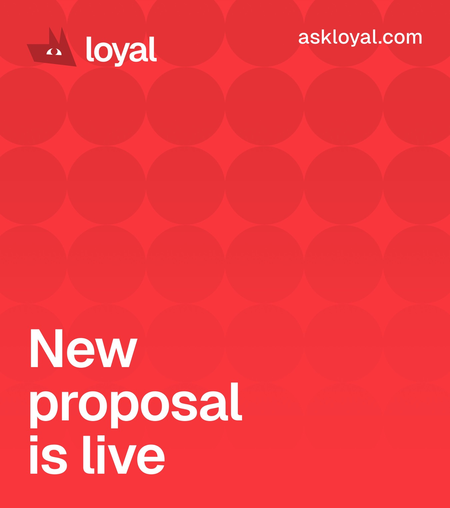
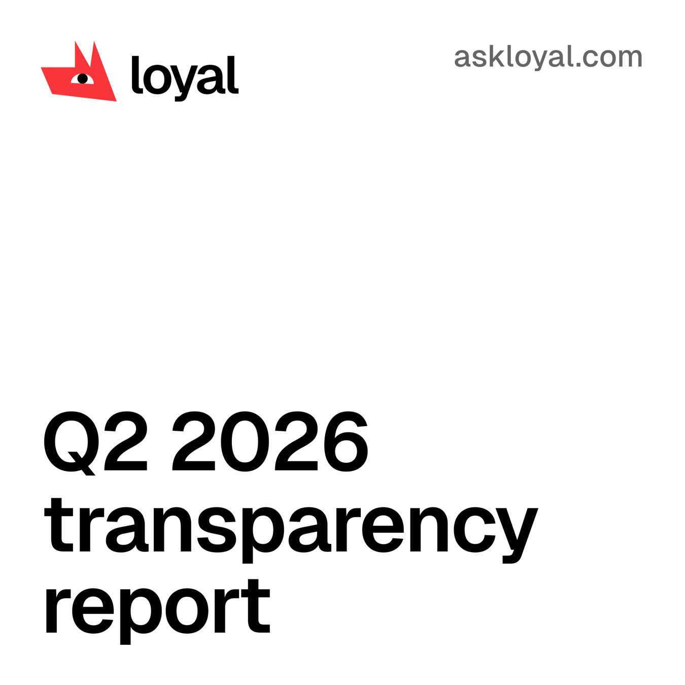

- We wanted to reach $300,000 in July. We doubled that and reached $600,000.
- 9,000 Seeker owners installed Loyal. Over 3,000 users launched an Earn agent.
- We passed the proposal and deployed the first Loyal autonomous vault for our MetaDAO treasury.

We launched the core Earn product the last week of June. Throughout July, growth was our only focus. Our goal for August is to keep growing active deposits and start securing the first business integrations.

In this article, we'll go over the growth of our deposits, highlight the product and governance updates that you might've missed!

")

[Watch the clip on X](https://x.com/loyal_hq/status/2084130312884531473)

## We Doubled Our July Goal

We hit $390,000 halfway through July. We finished the month above $600,000.

That's nearly three times the $200,000 we reported in June and twice the baseline target we set for July.

The growth came after Seeker Summer put Loyal in front of thousands of new users. Around 9,000 Seeker owners installed the app, and more than 3,000 went beyond opening it and launched an Earn agent.

The important number is not installs. It is deposits.

People connected wallets, approved policies for their smart accounts, and trusted Loyal automations to manage real money. The same product that crossed $200,000 in June crossed $600,000 before July was over.

You can track the numbers at [stats.askloyal.com](https://stats.askloyal.com/).

> Loyal hit 700k in TVL since our earn launch a month ago.
>
> We're enabling monetization soon after we finish some routing optimizations with all the revenue routed to the treasury.
>
> Also, closing our first B2B clients which should push the TVL to 7 figures.
>
> — [Rodion (@space_symmetry), Aug 3](https://x.com/space_symmetry/status/2084327765638307912)

## Updated webapp

In July, we shipped the rebuilt Loyal web app and improved the mobile experience. Users got clearer transaction details, historical earnings charts, QR receive, and an approval screen that explains each Earn transaction before it is signed.

We also improved the financial lifecycle behind the interface. A full withdrawal now closes the entire Earn setup in one flow and returns the remaining account rent. Realtime updates keep balances and transaction history current. Production monitoring records the cause of every failed flow so we can find problems quickly.

Loyal remains open source and onchain. Users keep custody of their money. Their smart accounts can only sign transactions that satisfy the permissions they approved.

This is the model we are building around: useful financial automation without giving up control.

## Governance Updates

LOYAL-003 passed in July and established the Loyal Autonomous Treasury Vault.

The vault is a Loyal Smart Account controlled by the DAO’s Squads treasury multisig and constrained by onchain policies. It can move capital between venues approved by the DAO and return funds to the treasury.

It cannot send funds to an outside address. It cannot sell LOYAL on the market, mint or burn tokens, or rewrite its own policy. Anything outside those limits still requires governance approval.

This gives the treasury room to automate routine operations without creating a new proposal and waiting through a multi-day governance market every time capital needs to move.

The vault went live on July 30. We rehearsed the flow with ten-cent deposits and five-cent withdrawals before moving real capital.

Its first authorized action withdrew exactly 50% of the DAO’s Futarchy AMM position: 176,688 USDC and 1,414,929 LOYAL.

Half of the USDC went into Loyal Earn. The other half returned to liquidity. The rollout had zero failed transactions.

We plan to sell policy-controlled treasury automation to other DAOs and businesses. Using it for our own treasury gives us a live proof point before we ask anyone else to trust it.

[Read the proposal thread on X](https://x.com/loyal_hq/status/2080122227111137289)

## Q2 Report

We published the Q2 transparency report. Operating expenses from April through June were 172,839.34 USDC, and every line was disclosed and reconciled against onchain movements.

Q2 revenue was zero. Earn only launched near the end of the quarter. July gave us the first meaningful base of active deposits from which product revenue can grow.

We will keep publishing the numbers when they look good and when they do not.

[Read the report announcement on X](https://x.com/loyal_hq/status/2079737101034385642)

## What comes next

July ended with more than $600,000 deposited, thousands of users, a stronger product, and a live treasury use case.

Next we are expanding Earn beyond USDC, building cross-mint routing, moving Watchdog forward, and turning the treasury infrastructure into business integrations.

The July goal was $300,000.

We cleared $600,000.

Now we keep going.

Always loyal,  
Chris

---

Website — [https://askloyal.com](https://askloyal.com)  
Docs — [https://docs.askloyal.com](https://docs.askloyal.com)  
Buy [$LOYAL](https://x.com/search?q=%24LOYAL&src=cashtag_click) on Jupiter — [https://jup.ag/tokens/LYLikzBQtpa9ZgVrJsqYGQpR3cC1WMJrBHaXGrQmeta](https://jup.ag/tokens/LYLikzBQtpa9ZgVrJsqYGQpR3cC1WMJrBHaXGrQmeta)  
Chrome extension — [https://chromewebstore.google.com/detail/cdienfadefhlaknmedckgifkjdbioack](https://chromewebstore.google.com/detail/cdienfadefhlaknmedckgifkjdbioack)  
Telegram Agent — [https://t.me/askloyal_tgbot](https://t.me/askloyal_tgbot)  
Telegram Community — [https://t.me/loyal_tgchat](https://t.me/loyal_tgchat)  
Discord — [https://discord.com/invite/tAwXsXwTv6](https://discord.com/invite/tAwXsXwTv6)  
X (Twitter) — [https://x.com/loyal_hq](https://x.com/loyal_hq)  
GitHub — [https://github.com/loyal-labs](https://github.com/loyal-labs)
