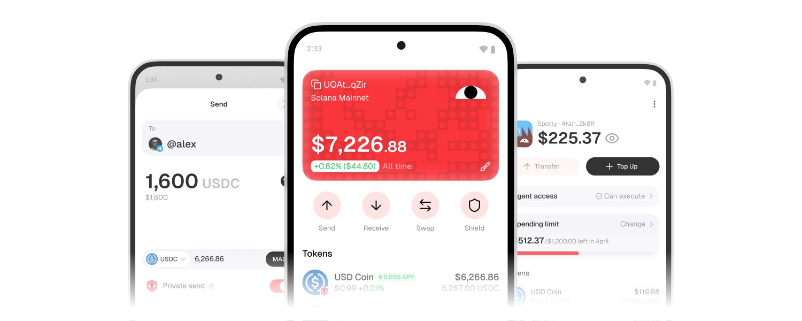

## TL;DR

Financial agents need wallet access to function, but handing them your private keys without guardrails is a disaster waiting to happen. Loyal on Seeker is the final form of decentralized, privacy-preserving, agent-powered finance.

## Rollout plan

→ **Phase 1**: Feature parity on the Solana Seeker. We are bringing private balances, handle-based payments, and shielded yield on USDC straight to your pocket.

→ **Phase 2**: Bounded automation via the introduction of smart accounts with on-chain guardrails a couple of weeks after our initial Seeker launch -  your agents will do the work of managing your private assets without accidentally buying Fartcoin while you're sleeping.

> [Learn more about Loyal](http://links.askloyal.com/)

## Details, details.

Agentic finance is here - if you're not onboarding, you'll be left behind - and your trading bots and portfolio rebalancers need wallet access to function. Right now, giving them that access means handing over your keys and hoping they do not hallucinate at 3 AM and drain your account into a memecoin.

Nobody solved the "what can be signed" problem. We did.

Loyal is the execution layer that makes agentic finance actually safe; you set the rules, the wallet enforces them on-chain, and the agent literally cannot exceed your limits.

We are proud to be bringing this entire stack to Solana's Seeker mobile phone, crypto is daily financial behavior -- it belongs on the worlds enthusiast crypto phone.

## Phase 1: Earn Yield on Private Assets

Before we can let agents run wild, we need the infrastructure in place, so our first step brings full feature parity from our web app directly to the Seeker dApp Store. This means you get a private, self-custodial account right out of the box.

- You get privacy a standard; shield and un-shield your Solana tokens at-will, send and receive without exposing your wallet addresses

- You get automatic APY on your shielded assets via [@kamino](https://x.com/kamino)'s single-asset lending vaults. You never have to choose between keeping your balance private and putting your capital to work.

- You get Telegram handle-based payments in addition to standard wallet addresses, so you can send SPL tokens to a Telegram @username instead of trading 44-character strings and hoping your clipboard survived.

Because we process the logic inside Confidential VMs, even we cannot see your data, the privacy we're talking about is baked into the hardware architecture as a baseline feature, not some afterthought.

Give us a try!

## Phase 2: Agentic Automation

This is the main event, and will be rolled out a couple of weeks after the Loyal Wallet hits the Seeker dApp store. Automation in crypto currently forces a terrible choice: sign every single transaction manually, or give a bot full custody.

Phase two removes the need for compromise.

We are bringing smart accounts with hard guardrails to Seeker.

1. You write the rule.

2. The account enforces it.

3. The software acts inside it.

Want a DCA agent that only buys specific tokens on a schedule? Define the token whitelist and set the spending cap. The agent will operate strictly within those parameters. Unverified contracts get rejected at the on-chain level.

You get bounded automation that executes while you sleep, while maintaining the our industry's founding ethos of decentralisation and privacy.

> Loyal Wallet on Seeker is where cypherpunk philosophy meets the hard-edge of consumer usability - your agent-powered, automated financial future; delivered without compromising your rights and freedoms.

## Why Seeker?

Firstly, mission parity - Seeker is the embodiment of functional, portable hardware security, and Loyal represents the same for agentic finance wrapped in cypherpunk ideals.

The Seeker dApp store also skips the bureaucratic red tape of Apple and Google, allowing us to ship faster and iterate with [@solana](https://x.com/solana) power users who actually push products to their limits.

... then there is the question of market size - the Seeker community is small, but while distribution matters, signal quality matters more.

We will be sponsoring gasless private transactions for every Seeker user to get things moving. We do not ask you to trust us with this rollout. We ask you to verify the hardware attestation. Trust the silicon, not the humans.

> [Learn more about Loyal](http://links.askloyal.com/) and prepare for the Seeker rollout.
