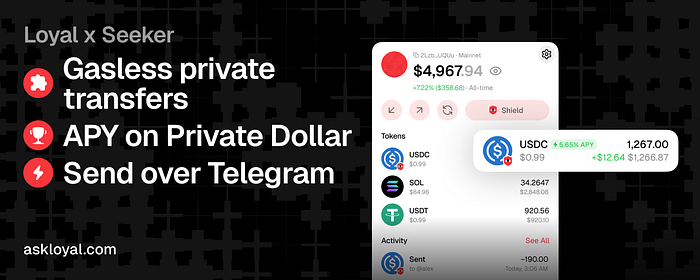

Great news! Loyal mobile app is coming to Solana Seeker in April!

We love the ecosystem that Solana Mobile team has fostered. Since August 2025, they’ve shipped over 200,000 devices and onboarded over 400 apps into dApp Store.

Loyal will be available for Seeker users through the Seeker dApp Store. We will be sponsoring gasless private transactions for every Seeker user!

## Why Seeker
We believe in importance of simplicity and distribution. Seeker has both.

There are over 200,000 Solana power users who have gone the extra mile in making Solana a core part of their daily lives. That’s distribution no one can compete with.

Unlike Apple’s App Store and Android’s Google Play Store, Seeker’s dApp Store has significantly less red tape we must tiptoe around to appease regulators. We can ship faster and start iterating with real users trying out a live app.

Securing our position among the Seeker userbase would give us a reliable platform to set up our further growth through iOS and Android.

## What Loyal Brings To Seeker
We are the only app that rewards you for keeping your money private. We are not charging swap fees or transaction fees intentionally. Our only incentive is delivering a great product and helping users multiply their money.

We believe that the best way to avoid catastrophic losses and multiple your fortunes is to keep it away from the prying eyes and make it easy to hold it long-term.

Hold your hard-earned cash and earn automatically!

## Android & iOS

Our current plan is to deliver Loyal app exclusively to seeker, iterate fast and capture devoted power users. We will focus on the full rollout on iOS and Android after.
