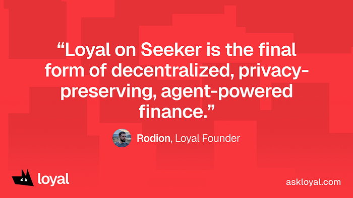

Loyal is now available to all Solana Seeker users!

Today, Seeker users are getting access to the fastest privacy product on Solana.

Next week, we’re rolling out access to smart accounts and automated workflows for boring money tasks!

Download the app now to get a head start on what’s next.

Give us a try!

## Private Agentic Finance
We’re committed to building open-source products that push the frontier of financial autonomy on Solana.

The Seeker community is full of people who have committed to making Solana a daily part of their lives. These are the most excited users who want to see the ecosystem thrive. As we deliver brand-new ways of engaging with internet capital markets, we can’t imagine having a better beachhead than the Seeker community.

We’re here to help users build and maintain healthy, long-term financial habits by making it easy to stay on top of your portfolio and earn money on private dollars.

For us, Loyal is about giving our users an easy and delightful way to multiply their wealth, while keeping the overall experience whimsical and heart-warming.

## Next Steps
We’re rolling out core features in two phases. Phase 1 brings our privacy features to Solana Seeker, Google Chrome extension, and our webapp. Phase 2 will empower our users with agentic automations to save time on boring financial tasks.

Starting today, everyone can earn up to 8% APY on each private dollar deposited in the Loyal app! All you have to do to start privately multiplying your wealth is make your first deposit.

If you’re anxious about missing out on today’s launch, don’t stress! We’ll be maintaining feature parity between our Seeker app, our Google Chrome extension, and our webapp. We’ll share more information on our iOS and Android launch after Phase 2 is complete.

Stay tuned for more updates coming soon, and thank you for being a part of our journey!

