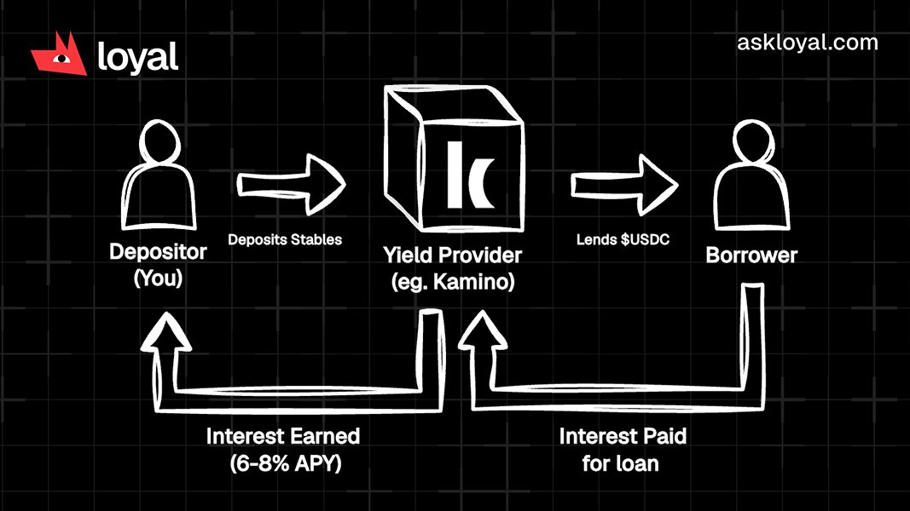

Bitcoin briefly dropped below $60k today, the US markets bled over $2.5t (**trillion, with a 'T'**), and while this is not unexpected to some seasoned traders - most investors can do better simply by being **boring** with their money.

The word "yield" has a **reputation problem** in crypto.

Say it to someone who has been around long enough and they picture **Luna**. Or an anonymous protocol promising 400% APY with no explanation of where the money comes from. Or the friend who lost everything in a "yield farm."

That reputation is earned because bad actors exist, and they destroyed the perception of a real business model that's been active in traditional finance for hundreds of years.

**But here is what most stablecoin holders don't know:**

The mechanism behind safe yield on crypto is identical to the mechanism your bank uses every day. The bank is doing it right now, with your money, without mentioning it.

The only difference is who keeps the margin.

## How Your Bank Makes Money on Your Savings

You deposit £5,000 in a savings account. The bank pays you 1.5%.

It lends the money to someone else - a mortgage holder, a small business, a car loan - at 5%, 6%, 7%. The bank keeps the difference. You get 1.5% because that's what it cost them to get you through the door. The rest is their operating margin.

Traditional banks take the majority of your yield

This is not a criticism of banks. It's just how lending works. Someone who needs capital pays someone who has it available. An intermediary facilitates the match and takes a [big] cut.

The mechanism has been working for centuries.

Here is the crypto version.

## The Same Thing, Different Pipes

Lending protocols like Kamino on Solana connect stablecoin holders with borrowers who need short-term liquidity - typically traders who want to open leveraged positions and need to borrow USDC or USDT to do it.

The borrower pays interest. That interest flows to the people who deposited into the vault. Kamino facilitates the match, manages the collateral requirements, and routes the funds.

**The mechanism is structurally identical to a bank savings account. Someone who needs to borrow pays someone who has spare capital. The intermediary takes a cut.**

The difference is the size of that cut.

A bank has branches. Staff. Marketing teams. Physical infrastructure. Shareholders. A DeFi lending protocol has smart contracts and audit reports. Its operating costs are a fraction of a traditional bank's. The margin it keeps is smaller. The rate it passes to depositors is higher.

Right now, Kamino's USDC vaults are paying between 4.5% and 5.5% APY. USDG vaults are at 9.5% to 9.8%. These are not promotional rates. This is what borrowers are currently paying to access liquidity on Solana - and it flows directly to depositors.

Compare that to what most people are actually earning:

- Euro area checking accounts: 0% to 0.05%

- US checking accounts: 0.05%

- Standard savings in the Netherlands: 0.25% to 0.50%

- Basic savings accounts: 1.0% to 2.0%

That last gap is not explained by risk. It is explained by habit.

Research shows that 82% of Americans don't use high-yield savings accounts despite the rates being widely available. In the UK, roughly 28% of people park most of their savings in a zero-interest current account out of routine.

Crypto is no different. Most stablecoin holders are earning nothing through habit or fear. The mechanism that would change that has been available for years.

## Why "Yield" Sounds Dangerous When It Usually Isn't

The association between crypto yield and disaster comes from a specific category of products and it's worth separating them cleanly:

**The things that went wrong:**

- Algorithmic stablecoins paying 20%+ with no auditable source of funds

- Protocol tokens minted to manufacture yield denominated in something that became worthless

- Cross-chain bridge exploits where collateral disappeared overnight

- "Yield farms" requiring simultaneous exposure to multiple volatile assets

**[@Kamino](https://x.com/Kamino)'s structural differences:**

- Single-asset lending vaults where you deposit one stablecoin and receive interest on it

- Over-collateralised loans where borrowers put up more collateral than they borrow

- Protocols with public audit histories, on-chain transparency, and significant TVL

Single-asset vault example on Kamino

*Note: all yield operations are done in the background for you when using the Loyal app, you simply approve, and your personal agent will ensure you always get the highest yield on your private, OR non-private funds.*

When you deposit USDC into a Kamino single-asset vault, you are doing one thing: lending it to borrowers who pay interest to use it.

- You can withdraw any time.

- You are not buying a token.

- You are not exposed to a volatile asset.

- You are not trusting a mechanism no one has reviewed.

The question worth asking about any yield is simple: **who is paying me, and why?**

On Kamino: a trader is paying you because they need your USDC to open a leveraged position. They put up collateral worth more than they borrow. If they don't repay, that collateral is liquidated to cover depositors. This is the same logic a bank uses to underwrite a secured loan.

A clean, verifiable source.

## The Part Nobody Says Out Loud

Your bank has been lending your money out for the entire time you have had a savings account. It has been collecting the interest spread, and it's been keeping most of it because banks are large, inefficient, and greedy.

You were not told because you did not need to be. You accepted whatever rate they offered and moved on.

DeFi lending does the same thing - except the protocol's operating costs are lower, so more of the rate flows back to you.

It is also worth noting the timing. The ECB meets on June 11, the Fed on June 17, the Bank of England on June 18. With inflation rising across most major economies, rate hikes are back on the table for the first time in years. If rates go up, traditional savings accounts may improve. But even if the ECB hikes back to 1.5%, Kamino's USDC vaults will still be paying 4% to 5%, and the outlier vaults will still be closer to 10%.

The infrastructure running this - Kamino's single-asset vaults - is the same infrastructure used by [@Phantom](https://x.com/Phantom), [@Anchorage](https://x.com/Anchorage), and [@pendle_fi](https://x.com/pendle_fi). Not exactly fringe protocols, right?

The only thing standing between a stablecoin holder and these incredible, low-risk returns is an over-complicated setup process where most interfaces assumed they already knew what they were doing.

**Loyal removes that assumption.**

You just deposit and approve; our upcoming yield optimizer will route your stablecoins continuously to the highest available safe rate across Kamino's vaults - meaning up to 11% APY for non-shielded assets. First yield credit within 24 hours, and you have the option to earn (less-optimized) yield on **private** stablecoins, a system unique to the Loyal app.

The mechanism was never exotic, the access just wasn't there.

***Now it is***

*-*

[*Learn more about Loyal*](https://links.askloyal.com)
