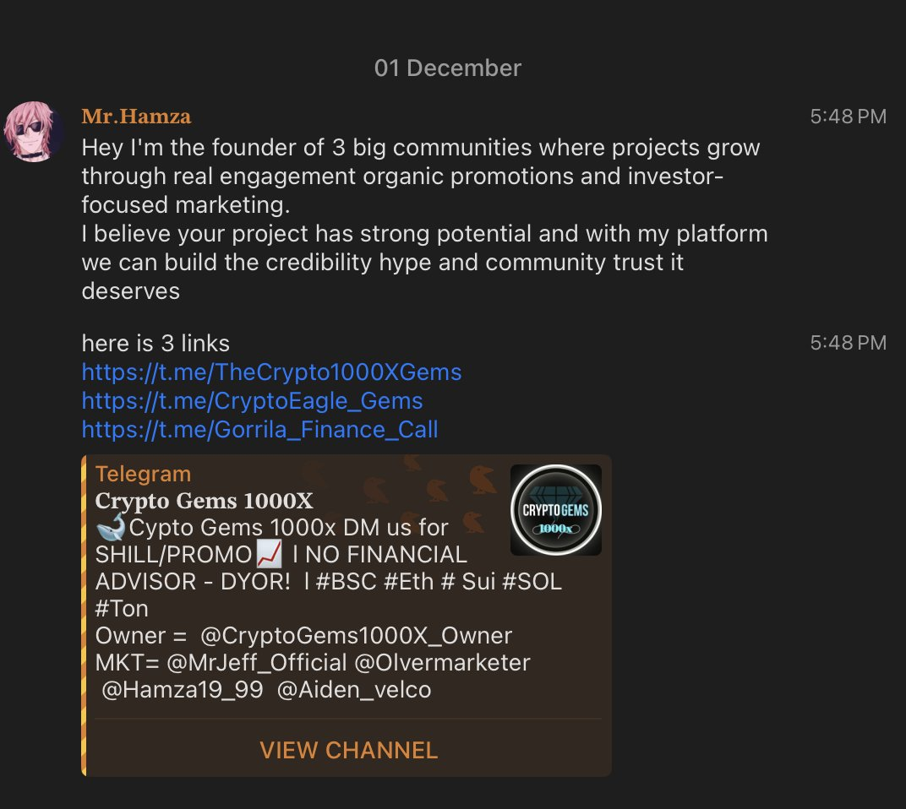
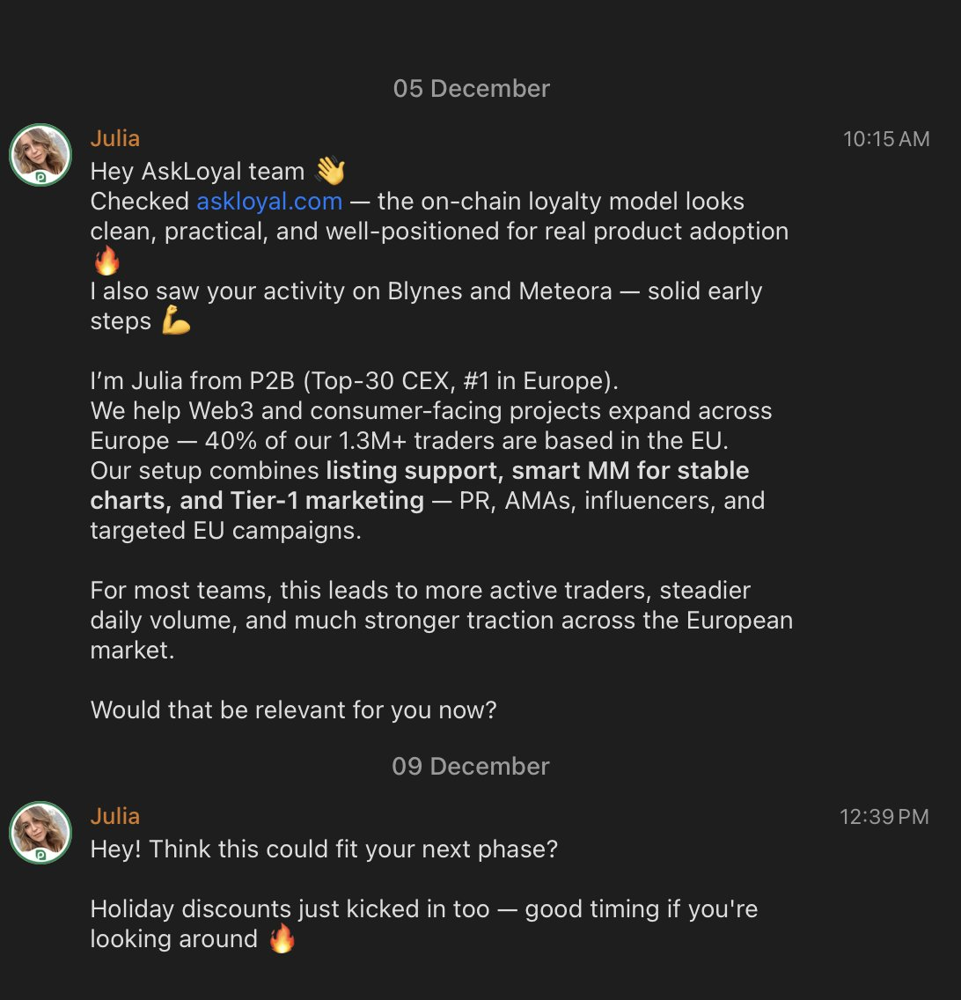

## TL;DR

- Breakpoint helped us validate distribution + get feedback on what users actually want from Loyal Telegram Agent

- We’re shipping **Loyal Telegram Agent** first to win distribution + retention in crypto-native comms

- Next: ship summaries + storage + the first “real” agent loop **before the end of the year** (waitlist ~60)

## Solana Breakpoint

Breakpoint was a good experience. Only **2 people** from our team attended, which meant the rest of the team kept shipping without interruptions. We were able to distribute the app, get feedback, and pressure-test our assumptions in real conversations.

The most important conversations we had were:

- with **Squads** (with Stepan)

- with [**P2P.org**](https://p2p.org) and several large validators

The most useful feedback loop we got was around **Loyal Telegram Agent**. The takeaway is that people indeed want an AI tool that eliminates chaos in Telegram. There are plenty of tools for email workflows and almost nothing comparable for Telegram, even though Telegram is where most day-to-day communication in crypto actually happens.

We also talked to a lead from **Solana Seeker**, and we’re seriously considering launching on **Solana Mobile**. The user base isn’t huge, but it’s active, and distribution there is direct: ship something useful and it gets seen.

## Loyal Telegram Agent: things we shipped, and why we started here

Loyal is an infrastructure that allows developers to use AI for their on-chain apps. But if you want to build infra (especially on Solana), you still need user adoption and developer attention and the fastest way to earn both is to ship real apps. That’s why we’re releasing Loyal Telegram Agent first. It’s a clean wedge: distribution is natural, use-cases are obvious, and go-to-market is very easy.

We currently have ~50 people on the waitlist, and we’re using that group to validate what should ship first and what can wait.

## Why Telegram

Crypto is very different from the other industries in terms of how people communicate and just generally discover each other. Discovery in crypto happens on X, but the real communication doesn’t. It happens mostly in Telegram.

In other industries, people default to email/LinkedIn/WhatsApp. In crypto, founders, BD, operators, and anyone publicly visible ends up managing:

- Too many chats. I personally have to deal with around ~300 new messages every morning even though I read and clean everything before going to bed.

- Too many groups. The same goes fro groups: I constantly get distracted by new messages in chats which don't really require my attention.

- Spam is absolutely out of hand. I can be focused on work, get notification and open Telegram only to see that:

And this is what every founder goes through.

Email had  more than 30 years of tooling evolution: clients, filters, smart inboxes, assistants. Telegram has almost none of that in a native-feeling way. Some Telegram CRM tools exist, but they’re separate web apps, they don’t feel native, and they  require more a lot of time to manage being useful only for sales/CSM peole.

That gap is what we're aiming to close with  Loyal Telegram Agent.

## What Loyal Telegram Agent is

1is a Telegram mini app with AI on top of Loyal infra. It can work with your personal chats, group chats, and new messages across Telegram. If you want, you can restrict access to certain chats using Telegram’s native tooling.

## What it does: shipped vs next vs later

Shipped (mainnet)

- **Solana transactions on mainnet** using Telegram handles

In progress (shipping before the end of the year)

- Chat summaries: summarize groups, highlight what matters, and help you catch up without scrolling

- User-owned storage + summary pipeline prepared

- Frontend and design for summaries are ready

- What remains: connect backend to frontend, connect summarization model, run initial tests

Later (roadmap)

- Chat prioritization: screen new messages and surface what actually requires attention

- Spam filtering: detect spam/scam patterns and route them out of your primary flow

- Payments + automations: “send 20 USDC to the most active community members this week” → sign → done, without collecting addresses

## Where GTM fits in

This is a strong go-to-market strategy for three reasons:

1. Clear target user that we can leverage for further distribution. We’re aiming at a specific pain point that founders and crypto BD live with daily: Telegram overload.

2. Retention is native**.**Telegram chaos doesn’t go away. If summaries and payments become part of the workflow, users return naturally.

3. Distribution is cheap**.**The app is currently free and we’ll have a free tier. The target audience is easy to identify, and we already talk to founder communities daily. Distribution cost here is close to zero.

## What this means for holders

Telegram agent itself isn't the end goal but rather a leverage.

If we get Loyal Telegram Agent into daily workflows for founders/BD/operators, we earn:

- repeated usage (retention)

- trust (especially around privacy expectations)

- distribution into teams and communities

- a direct channel to introduce the next layer of Loyal: developer tools and on-chain app integrations

That’s how this becomes meaningful at the ecosystem level: **a product that wins attention first**, then expands into infrastructure adoption.

## What’s next

- Finishing wiring summaries end-to-end (backend ↔ frontend ↔ model)

- Shipping the first full “summary loop” **before the end of the year**

- Onboarding from the **~60-person waitlist** and iterate quickly based on what they actually use

## Community updates

There are a lot of things we need your attention during the next week:

- Infographic competition, read more here: [https://x.com/loyal_hq/status/2002027637187772652](https://x.com/loyal_hq/status/2002027637187772652)

- Community members prepared proposal for withdrawing and burning 900k tokens from single-sided Meteora LP. We'll post more info on that in coming days.

- We're finishing the selection process for Sector 0 and applicants will know at the beginning of the next week if they were accepted. The next week will be packed so stay tuned.
