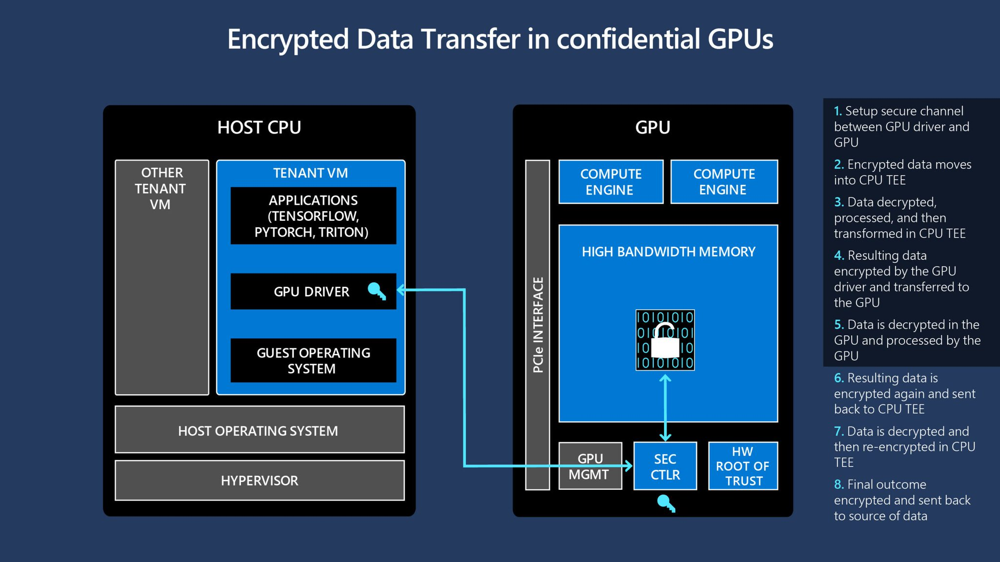
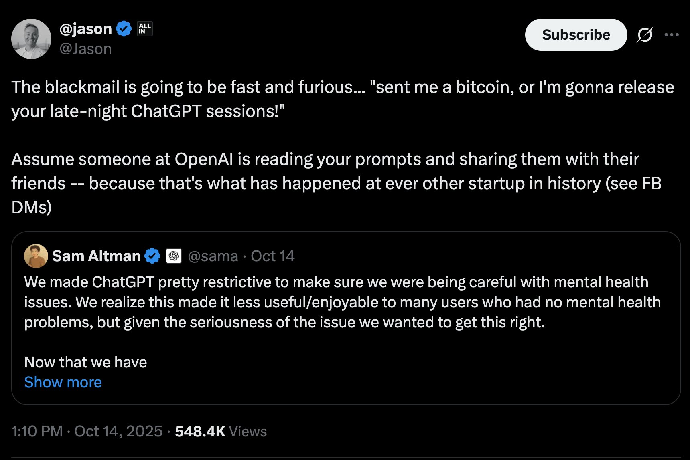

Privacy, technology, and consumer choices have shifted. Application architecture has to keep up.

Web1 and Web2 apps that touched user data did relatively simple things. To send a private email, it was enough to encrypt the text with PGP. As the services developed, the architectural complexity grew with them. Soon, PGP was not enough and we looked for self-hosted servers for storage, messaging and collaborative docs.

Self-hosted solutions are a relic of the old paradigm. As a rule, even a microwave could run most of those services. That is not the case for modern LLM-driven apps. Realistically, very few people have enough GPUs to keep state-of-the-art LLM running locally – not to mention the electricity bill that would inevitably bring in. Even if a consumer (or a small business) is looking to host a smaller model locally, they’d have to spend hundreds – if not thousands – of dollars on hardware. LLM-centric services are bringing in the new paradigm and new challenges that we must respond to.

As we look at the modern privacy-focused solutions on the market, we must point out a glaring hole in their security model. Open-source SaaS solutions and E2E encryption (as implemented, for example, in Lumo) do not guarantee full privacy to the users. Even if we give hardware operators a benefit of doubt and assume that they’re actually running the code we see in repositories, they do not address the vulnerability of data as it moves between CPU and GPU kernels. GPU is as much an attack surface as anything else and hardware operators have full control over it.

The new era of artificial intelligence calls for the new approaches to security.

We argue that open-source products with hardware verification running within confidential VMs and confidential GPUs is the only viable solution that guarantees protection of user data. This setup ensures that even the hardware owners have no access to your data as it’s being processed. At the same time, we must utilize encryption and decentralized storage to allow everyone to move their chats across apps removing a single point of failure that is one vendor.

You can read more in the architecture docs:

[ docs.askloyal.com](https://docs.askloyal.com/)

.

## Open source and E2E is not enough anymore

Anyone and inspect open source code. E2E protects user data in transit and at rest. But neither of these things address fundamental concerns about data in use:

- LLMs are run on remote GPUs. The data appears in plaintext as it’s being processed.

- There’s no way for users to verify that the servers are running the same code they see on github.

- Root on the host, malicious hypervisor or a rogue admin (eg case of Facebook DMs) can have unprevented access to user data.

We cannot in good faith keep protecting the old paradigm. E2E and open source are necessary but they’re not enough to keep you safe in these times.

## How Loyal works

Fundamentally, Loyal rebuilds the root of trust starting with the hardware. We use Intel chips with built-in hardware encryption keys. These chips allow us to do two important things: run virtual machines with encrypted RAM and take a cast of the launch parameters of each machine to show the code it is running. On top of that, we use Nvidia Hopper GPUs. They allow us to run confidential compute within them and guarantee that no one can access your data at no point in time.

## Request flow

1. **Client key generation**The client creates or loads an asymmetric keypair. The public key identifies the user. The private key never leaves the client.

2. **Remote attestation**Before any data moves, the client verifies an attestation quote from the target Loyal machine that binds the running measurement to the published Loyal binaries. If it matches, the client moves to the next step.

3. **Model execution inside the Loyal machine**The confidential service receives user inputs within the encrypted enclave. It passes data to GPUs running in confidential compute mode through a secure channel built upon mutual hardware attestation. At no point memory or context are unsealed and visible to anyone.

4. **Encrypted artifact storage on-chain**Response is then streamed back to the user and uploaded to decentralized storage attached to the user's public key. Only the user has access to it and can decrypt the data.

5. **Micropayments without API keys**The client pays for inference through onchain contracts tied to the session. There are no static API keys to manage, access is completely permissionless within network rules.

6. **Interoperability**The responses are streamed back and stored in OpenAI-compatible format. This removes dependency on our frontend and allows users to self-host it themselves or fork it and make any changes they deem fit. They can switch UI without the headache of database migration.

This is intentionally high level – see

[ docs.askloyal.com](https://docs.askloyal.com/)

for the architectural details.

## Loyal is just better

- **Trust minimization** – You do not grant blanket trust to a hosting provider. You verify the code identity and confine plaintext to a hardware-enforced enclave.

- **Verifiability** – Remote attestation gives a concrete, checkable statement about what runs where. This is stronger than contractual promises or opaque privacy policies.

- **Portability** – An encrypted, on-chain history lets you move between frontends and integrate with other tools without re-uploading or exporting data silos.

- **Permissionless access** – Sub-cent micropayments replace brittle API key distribution. Anyone can build a client that speaks the protocol and pays for what it uses.

## Why it matters

## Individuals

- Bring-your-own frontend that talks to the same encrypted history. Switch from a terminal UI to a web UI without migrating chats.

- Private cross-app memory under your keys – reuse context across projects without uploading files to multiple vendors.

## Teams

- Shared spaces with per-member keys and auditable access. Collaborate while keeping prompts and outputs unreadable to the operator.

- Least-privilege integrations – grant a bot access to a subset of artifacts by sharing only the needed decryption keys.

## Enterprises

- Regulated workflows with verifiable compute boundaries. Prove that sensitive prompts and outputs never left attested TEEs.

- Vendor flexibility – run against different TEE providers while keeping the same encrypted history and payment flow.

Services positioned as “private AI assistants” – for example,

[Lumo.ai](https://lumo.ai)

– aim to improve privacy within a conventional SaaS approach. The hard limit remains the compute trust boundary: without confidential machines, the host can access data in use. Loyal’s design addresses that exact gap while preserving cloud-class performance and model choice.

## Conclusion

Open source and E2E encryption remain essential. However, In cloud LLM settings, they are no longer sufficient on their own because the provider sees data in use. Loyal moves the trust boundary into attested hardware, stores artifacts encrypted on-chain for portability, and replaces static API keys with micropayments. The result is a practical step up in privacy without giving up modern models or the convenience of cloud compute.

If this matches the problems you are trying to solve, explore the architecture details at

[ docs.askloyal.com](https://docs.askloyal.com/)

.
