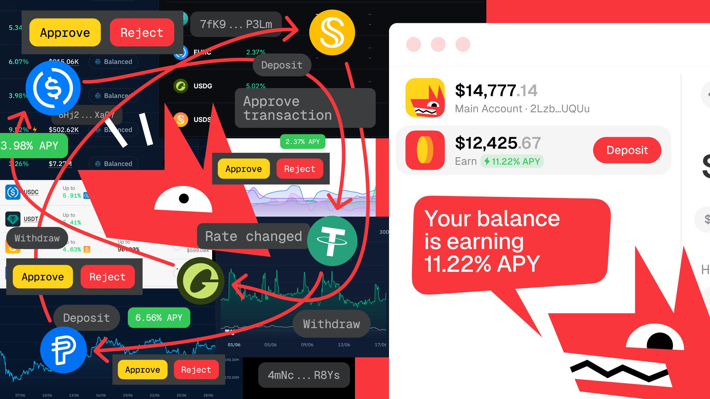
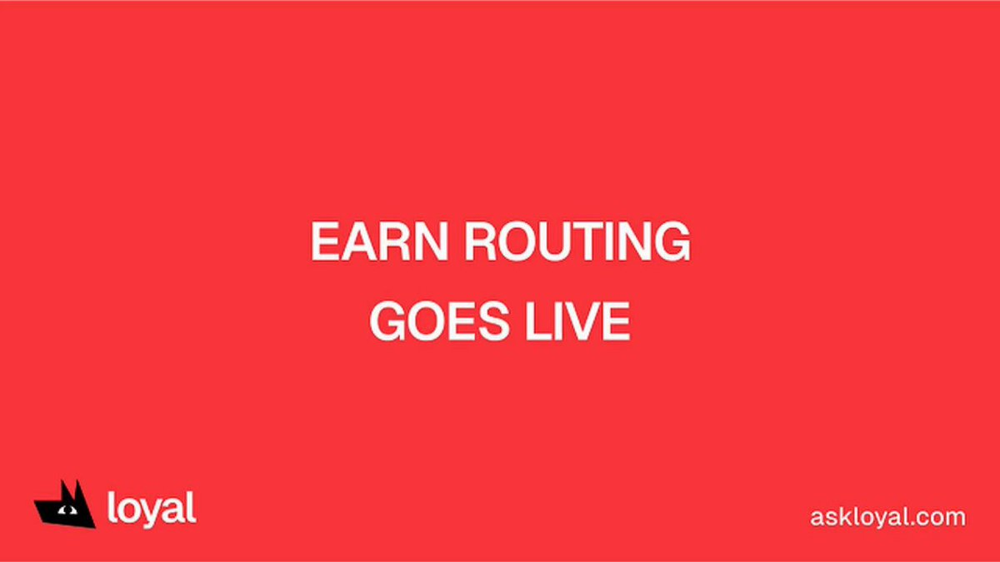
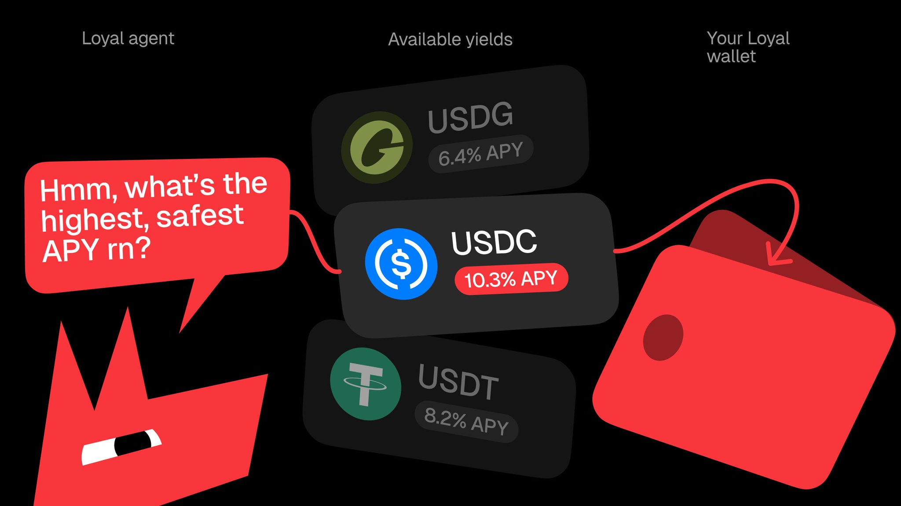
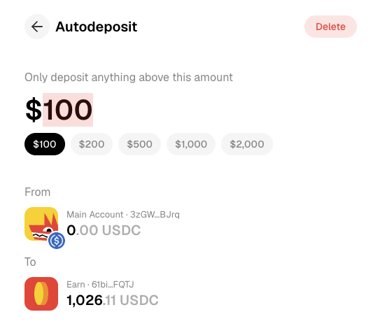
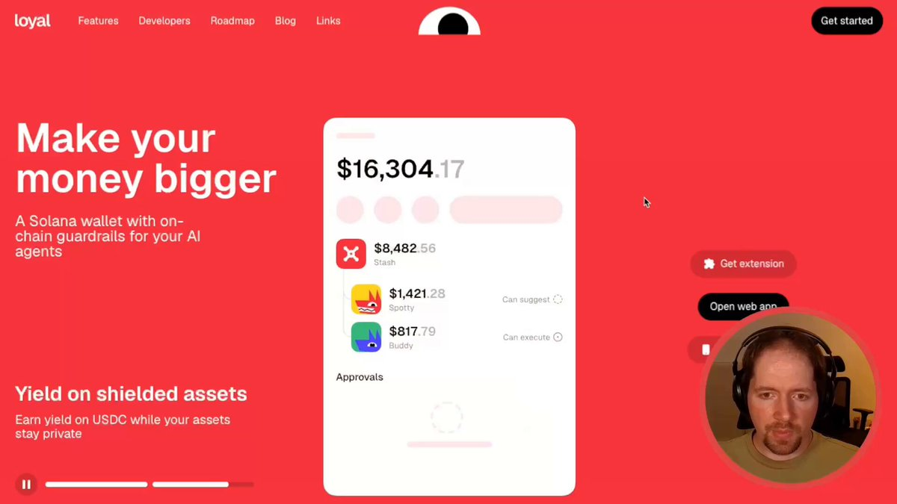

At Loyal, we love making money - and we know you do too.

... but it's really easy to let fear and laziness cost you real gains, think about it:

1. Your stablecoins land in your wallet. A paycheck, a payment, a transfer from an exchange; whatever it might be.
2. Those funds just sit there for an hour, a day, a week, or maybe even forever before you do anything with them.
3. While they sit there idle, they can easily be earning substantial rewards for you.

You probably think the fix is "get some yield I guess?"

Kinda... unfortunately that also assumes you have the time and ability to navigate DeFi UX hell for what might seem like pennies in return. If you want the kind of APY that makes a real impact; you need to be manually watching pairs like a hawk all day every day - you don't have time for that, no one does!

Stablecoins actually have the ability to net you double-digit APY% consistently; but only if you're willing to make it a full-time job, staring at the various pairs and protocols all day long to do it.

That's where Loyal comes in - agentic finance that finally does something useful.

We just give you what you want (earning more, with low risk) automatically, with zero interaction by you after 60 seconds of setup: the biggest, passive rewards on stablecoins that you already own in your [@solana](https://x.com/solana) wallet.

## Who Loyal is for

If you hold stablecoins and they're not earning, it's for you.

If you've been burned in the trenches and want something real instead of a 100x promise that turns into a 100x loss, it's for you.

If you're new to crypto, and want to just get started without complicated wallet setups and with fast, visible results, it's for you.

[Watch the clip on X](https://x.com/loyal_hq/status/2069918828558266525)

You don't need to know what a vault is. You don't need to follow rates. You don't need to have "figured out DeFi." Most people holding crypto haven't, and that's not a personal failing.

**90% of stablecoins on-chain earn nothing.**

The tools that could fix that have been too complex, too slow, or too expensive for the average holder to bother with.

You might have a few thousand dollars sitting in a wallet you're "fine" with. You might be a power user who's tired of babysitting positions. Either way, the job is the same: make idle money work, without making it your second job.

## What it does for you now

Our latest feature is called **Loyal Earn**, and it's live right now.

You deposit USDC, and an agent puts it to work across Kamino's highest-yielding safe vaults. Kamino is the same lending infrastructure used by Phantom and Anchorage, so the rates are public and real, not a number we made up. The agent doesn't park your money in one spot and forget it. It moves your funds to the best available safe rate, in real time, so you're always in a strong position without lifting a finger.

On non-shielded stablecoins, that's **currently 10% APY.**

You also get a choice most wallets don't give you:

- **Keep your money transparent**, and the optimizer runs at full strength.
- **Shield your money for full privacy**, and you earn up to 8% APY.

Why the difference? The optimizer can't route funds it can't see. Shielding hides your balance from everyone, including the part of Loyal that chases the best rate. So privacy costs you a few rewards. For most people the 11% is the win and privacy is a nice bonus. For a few people privacy is the whole point, and 8% still beats almost everything else they could get.

Then there's the part that closes the gap I started with.

## The thing nobody else fixes

It's called **auto-deposit**, and it's the quiet hero of the whole app.

You set one number. Say you want to keep $100 liquid for spending. Anything above that, the app sweeps into Loyal Earn automatically, the moment it arrives. No clicking. No remembering. No "I'll do it this weekend."

Picture your paycheck landing on a Friday.

Normally it sits in your wallet until you get around to it, a couple of days - maybe a week later, earning nothing the whole time. With auto-deposit, the extra goes straight to work and starts compounding your rewards the second it lands, earning up to 11% APY from minute one.

One paycheck, one week early, doesn't sound like much. But this happens every cycle, all year, for as long as you hold money.

**The money you lose isn't in the rate you pick. It's in the days your cash sits still between getting paid and getting started.**

That's the part manual setups can't fix, because they depend on you remembering. Auto-deposit doesn't depend on you at all. It removes the one step that human beings reliably skip.

And your money never leaves your control. Loyal is self-custodial. Your keys, your funds, in Loyal Earn or anywhere else in the app. You can pull it out whenever you want, no lock-up.

## How to earn with Loyal

Three steps:

1. **Click on "Open Web App"** at [askloyal.com](https://askloyal.com/). Log in with your Loyal wallet, [@phantom](https://x.com/phantom), or [@MetaMask](https://x.com/MetaMask). You don't need a new wallet to start.
2. **Deposit your USDC** into Loyal Earn and approve the transaction. Your money starts earning right away.
3. **Turn on auto-deposit** and set your spending threshold. Now every dollar above that line goes to work on its own, forever.

That's the whole setup. After that, the app does the job and you go back to your life.

We cover the wallet creation fees for you, and remove all the painful DeFi annoyances.

## What's coming next

Right now Loyal Earn lives in the web app.

It's coming very soon to Solana Mobile, Android, and Telegram. The goal is simple: put the same automatic earning everywhere your money already moves, so the gap between "got paid" and "earning" disappears no matter which screen you're looking at.

The direction is the same one we started with. Take the work of money management off your plate, keep your funds in your own hands, and let the boring, steady compounding happen in the background while you think about literally anything else.

Your stablecoins were taking a week off every month. Now they don't have to.

Stay Loyal.
