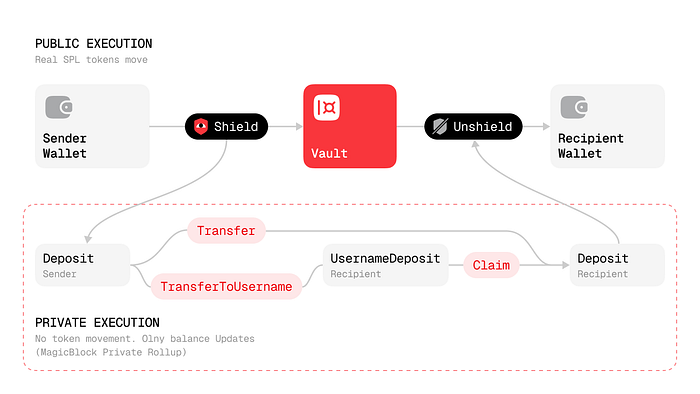
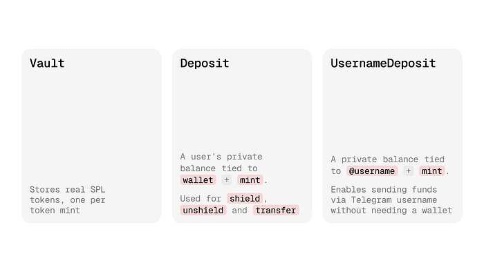
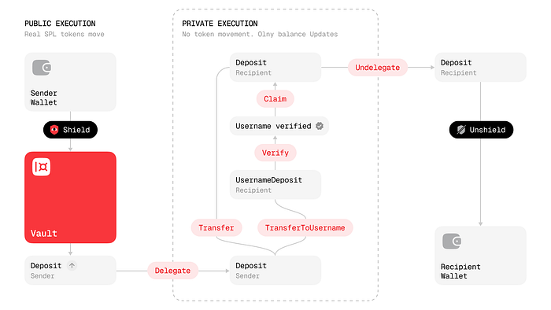
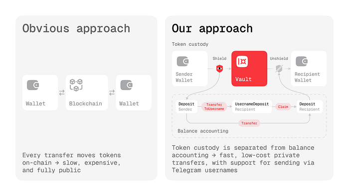

## Private Solana Transfers by Telegram Username

One of crypto’s most powerful features — seed phrases and private keys that guarantee true ownership of your assets — is also its biggest obstacle for normal people. I know a dozen people who have used crypto for years and have absolutely zero idea what a seed phrase is, because they’ve never left their CEX. For better or worse, that’s how it is, and these people will flatly refuse to accept anything unless you send USDT to their exchange account.

We wanted to bridge these two worlds without giving up privacy: let someone send money to their mom or a friend without asking them to remember 12 words or hand over a long address — just use their Telegram username.

So we built a Solana program that lets users send SPL tokens to a Telegram username, while keeping the fast transfer logic inside MagicBlock’s Private Ephemeral Rollups. The trick is that the program does not move real tokens every time users send funds to each other. Instead, it separates custody from accounting.

In this article we’ll take a deep dive into how our smart contract works.

## The core idea: keep real tokens in one place, move balances everywhere else

At the center of the program are three account types.

A **Vault** holds the real SPL tokens for a given mint. It is the actual custodian.

A **Deposit** tracks a user’s private balance for that mint. It is just an on-chain ledger entry: wallet + token mint + amount.

A **UsernameDeposit** does the same thing, but for a Telegram username instead of a wallet address.

That means the program works in two layers at once:

*   The **Vault** stores real assets.
*   **Deposit** and **UsernameDeposit** accounts store internal balances.

When someone shields funds into the system, tokens move from their wallet into the Vault, and their Deposit balance increases. When they unshield, tokens move back out of the Vault, and their Deposit balance decreases.

But when one user sends funds to another user — whether by wallet address or Telegram username — no real tokens move at all. The program only subtracts from one balance and adds to another.

That is exactly why private transfers can run efficiently inside MagicBlock’s private runtime.

## Why this matters for privacy and speed

Public blockchains are very good at being public. A little too good, frankly.

If every transfer had to move real SPL tokens on the base layer, then every handoff would be more expensive, slower, and harder to make private. By keeping the Vault fixed and treating transfers as balance updates, we can delegate those balance accounts into MagicBlock’s Private Ephemeral Rollups and execute the private parts of the flow there.

So the architecture becomes:

The Vault is the safe. Deposits are the ledger.

## The building blocks

## 1\. Deposit

There is one Deposit PDA per `(user wallet, token mint)` pair. It stores:

*   the owner wallet
*   the token mint
*   the private balance amount

This is the account a user shields into, transfers from, claims into, and eventually unshields from.

## 2\. UsernameDeposit

There is one UsernameDeposit PDA per `(Telegram username, token mint)` pair. It stores:

*   the Telegram username
*   the token mint
*   the balance claimable by that username

This is what makes the UX feel human. The sender does not need the recipient’s wallet address. They send to `@username`, and the recipient later proves ownership of that username and claims the balance.

## 3\. Vault

There is one Vault PDA per token mint. Its associated token account holds the real tokens.

Transfers between users do not move tokens in and out of the Vault. The Vault only participates when users enter or leave the private system.

## How the flow actually works

## Step 1: Shield tokens into a private deposit

The user initializes a Deposit account if needed, then calls `modify_balance` with `increase: true`.

That does two things in one instruction:

1.  transfers real SPL tokens from the user’s token account into the Vault
2.  increments the user’s Deposit balance by the same amount

From that moment on, the user has a private internal balance they can move around without touching real token custody.

## Step 2: Give the private runtime access

Before a delegated account can be used inside MagicBlock’s private runtime, the program creates a permission account with access-control flags.

That permission layer is what turns normal public Solana state into a private execution flow inside PER. In plain English: it controls who can see and interact with the delegated account in the private runtime.

## Step 3: Delegate the balance account

The Deposit is then delegated to MagicBlock.

Once delegated, the private operations happen against the delegated balance account instead of the base-layer program-owned account. That is the moment the flow switches from normal Solana execution into private ephemeral execution.

## Step 4: Transfer to a Telegram username

For username-based transfers, the destination is a `UsernameDeposit`, not another wallet Deposit.

The transfer itself is beautifully boring:

*   subtract from the sender’s Deposit
*   add to the recipient’s UsernameDeposit

No real SPL tokens move.

One important implementation detail: for the private transfer path, the destination UsernameDeposit needs to exist and be set up for PER first. In practice, that means the username-based deposit account is initialized, given permissions, and delegated before the private transfer happens. The SDK handles this choreography much more gracefully than a human ever should.

## How the recipient proves they own `@username`

Sending to a username is only useful if the rightful owner can claim it.

That is where the Telegram verification program comes in.

The app stores Telegram init data on-chain in a `TelegramSession`, then verifies the Ed25519 signature against Telegram’s public key. Once the session is marked verified, the private transfer program can trust three things during claim:

*   the session is verified
*   the session username matches the `UsernameDeposit`
*   the session wallet matches the recipient Deposit

So a random wallet cannot walk in wearing a fake moustache and claim someone else’s username balance.

## Claiming is also a private balance move

Claiming does **not** withdraw real tokens from the Vault.

Instead, `claim_username_deposit_to_deposit` moves balance from:

*   `UsernameDeposit(@username, token)`
*   into `Deposit(wallet, token)`

That means claim is still an internal accounting operation, just like transfer.

For the private claim flow, the recipient’s normal Deposit also needs to be ready for PER. In other words, the recipient must have a Deposit account, permissioning, and delegation in place before the claim runs privately.

After the claim, the user can commit the delegated state back to base layer, undelegate, and then unshield real tokens back to their wallet.

## The full end-to-end picture

Here is the simplified lifecycle:

1.  **Shield**: move real tokens from wallet to Vault and credit Deposit.
2.  **Permission + delegation**: prepare the sender’s Deposit for private execution.
3.  **Prepare the username lane**: initialize, permission, and delegate the recipient’s UsernameDeposit.
4.  **Private transfer**: move balance from Deposit to UsernameDeposit inside PER.
5.  **Telegram verification**: prove that a wallet controls the Telegram username.
6.  **Prepare recipient Deposit**: initialize, permission, and delegate the recipient’s wallet Deposit.
7.  **Private claim**: move balance from UsernameDeposit to recipient Deposit inside PER.
8.  **Commit + undelegate**: return state from PER to base layer.
9.  **Unshield**: withdraw real SPL tokens from the Vault back to the wallet.

That sounds like a lot when written out longhand. Which is exactly why we wrapped it in an SDK.

## The SDK hides the two-world problem

Our TypeScript client, `LoyalPrivateTransactionsClient`, keeps both sides of the system alive at once:

*   a **base-layer Solana connection** for setup, shielding, permission creation, and delegation
*   a **MagicBlock PER connection** for private transfers, private claims, and undelegation

So the app does not need to manually switch mental models every few lines of code. The client routes each call to the correct environment and enforces the expected delegated or non-delegated state along the way.

That is a small UX detail for developers, but it makes the whole product much easier to build reliably.

## Why this design is better than “just send tokens on-chain”

The obvious approach would be to transfer tokens directly every time someone sends funds.

That would be simpler on paper, but worse in practice.

By separating custody from accounting, we get:

*   username-based transfers without needing wallet addresses up front
*   private balance updates inside MagicBlock PER
*   fewer real token movements on the base layer
*   a cleaner bridge between Telegram identity and Solana ownership

In other words, we turned Telegram usernames into a usable routing layer, while keeping Solana as the settlement layer.

## The fun part

The weird little magic here is not some monstrous zero-knowledge cathedral. It is a more pragmatic trick: keep assets in one place, move balances privately, and only settle real tokens when users actually want to enter or leave the system.

That is what made private Solana transfers over Telegram username possible.

And once you see it that way, the system stops looking like a pile of custom instructions and starts looking like what it really is: a private ledger wrapped around a public chain, with Telegram identity acting as the human-readable address book.

Website — [https://askloyal.com](https://askloyal.com/)
  
Docs — [https://docs.askloyal.com](https://docs.askloyal.com/)
  
Buy $LOYAL on Jupiter —  
[https://jup.ag/tokens/LYLikzBQtpa9ZgVrJsqYGQpR3cC1WMJrBHaXGrQmeta](https://jup.ag/tokens/LYLikzBQtpa9ZgVrJsqYGQpR3cC1WMJrBHaXGrQmeta)
  
Telegram Agent — [https://t.me/askloyal\_tgbot](https://t.me/askloyal_tgbot)
  
Telegram Community — [https://t.me/loyal\_tgchat](https://t.me/loyal_tgchat)
  
Discord — [https://discord.com/invite/tAwXsXwTv6](https://discord.com/invite/tAwXsXwTv6)
  
X (Twitter) — [https://x.com/loyal\_hq](https://x.com/loyal_hq)
  
GitHub — [https://github.com/loyal-labs](https://github.com/loyal-labs)
