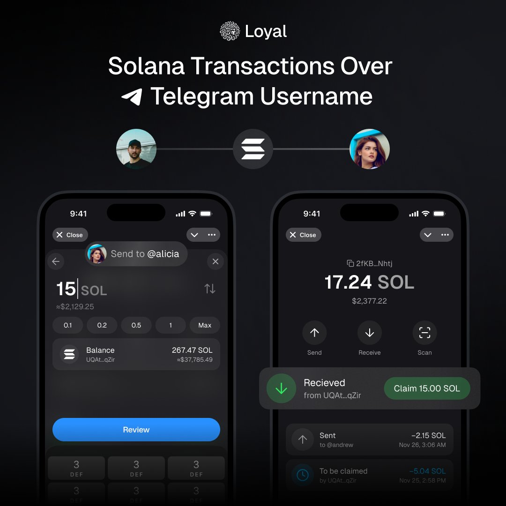
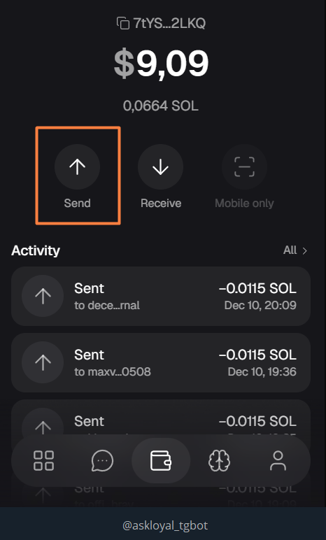
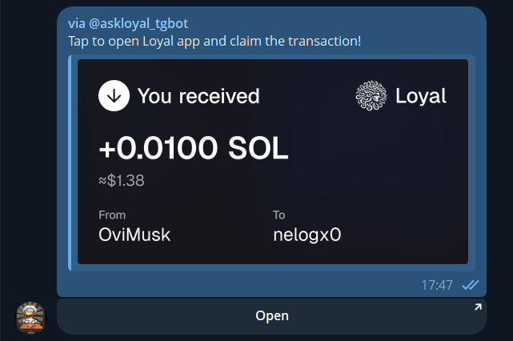
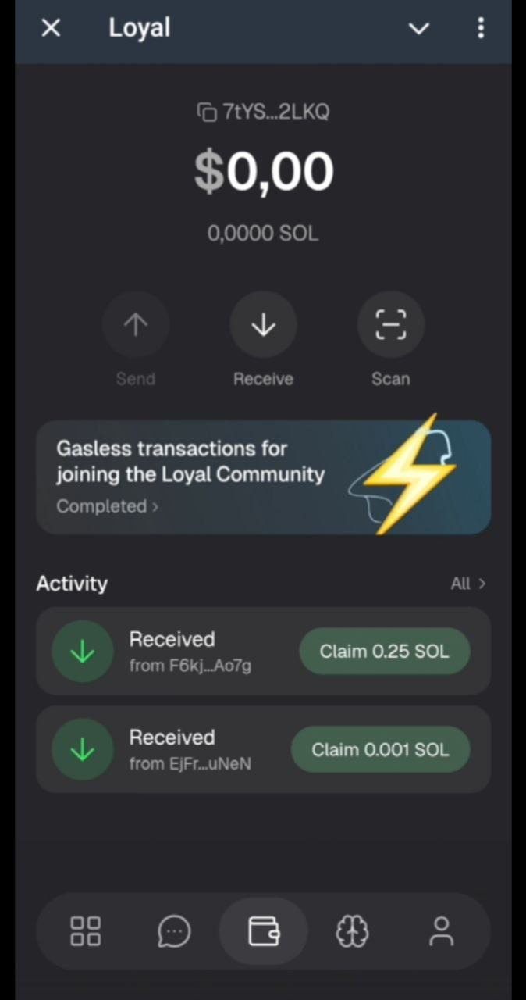
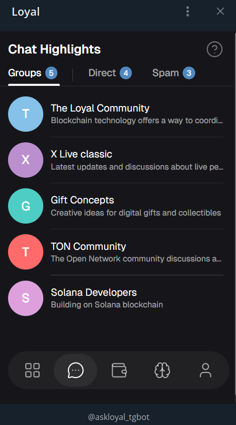

## Privacy matters

Privacy tends to become a narrative for the users while their onchain transactions are transaparent and AI-interactions stored on the 3rd party servers.

Loyal focuses on building tools and infrastructure using  private permissionless AI oracles powered by the

[@magicblock](https://x.com/magicblock)

.
Purpose is to provide services that offer privacy as a default value.

Today we're launching public version of the Loyal mini-app for our telegram users.

[https://t.me/askloyal_tgbot](https://t.me/askloyal_tgbot)

Now it's possible to send the Solana using telegram handle in 2 clicks and our private AI helps keeping information in the chats structured and away from the spam.

## How it works

Users can send Solana directly to any other account in telegram by knowing its handle.
No long wallet addresses required.
👉**Disclaimer:*****current app version supports only Solana transfers. Any other tokens sent will be lost.***

Use tg username to send SOL via Loyal app

## How to send Solana to your friend

In order to start using this method you need:
1) Get to the Loyal mini-app

[https://t.me/askloyal_tgbot](https://t.me/askloyal_tgbot)

2) Choose Send option

3) Enter telegram @ handle
4) Choose SOL amount to send
5) Confirm

## How to claim received Solana

Once you receive any SOL transaction  you can get a notification if your friend shares it with you.

Push notification of received transaction

## How to claim SOL

:
1) Open telegram mini-app

[https://t.me/askloyal_tgbot](https://t.me/askloyal_tgbot)

2) Find received transaction on the main page

FInd the received SOL transaction on the main page and claim

3) Claim the amount
👉*Claims are gassless in the application.*

## AI powered chat navigation and anti-spam filter

Loyal App focuses not only on becoming as a 1 click Solana transfers tool.
It allows to organize the flow of inbox and group chats with the private AI solution.

Group chat summaries filtered by private AI  Loyal oracle

This will help user to avoid missing important news and alpha from the group chats.

As well as to lower the amount of spam messages just by filtering them.
Such option provides higher security against potential scam links and offers.

You can stay in contact and updated while continuing using telegram inside the Loyal app.

## Loyal plans

Loyal focuses on building tools for the community across the web3.
Team is open for dialogue. Therefore, if privacy topic is meaningful you can connect with us.

- Part of the core team attends the [@SolanaConf](https://x.com/SolanaConf) - so it's an opportunity to reach out IRL during this event

- There are regular community Friday streams - awesome place to get real-time updates about the project status

- Our core contributors can share the privacy vision among the platforms and we appreciate that. New Loyalty programme will go live in December [REDACTED]

We're welcoming you to join our socials
X:

[@loyal_hq](https://x.com/loyal_hq)

| TG:

[https://t.me/loyal_tgchat](https://t.me/loyal_tgchat)

| Discord:

[https://discord.gg/h878D2yBJ7](https://discord.gg/h878D2yBJ7)

Stay Loyal.
