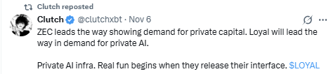
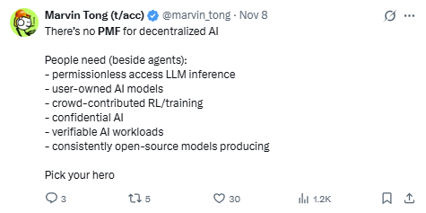

If someone printed your LLM chat history today and read it out loud, how screwed would you be?

We’ve got people who triple-check mixer routes, freak out about address reuse and then casually dump their questions about tax optimisation, side hustles, health issues, affairs, and leverage plays straight into centralized AI apps. Crypto is fighting surveillance on the financial layer for years now, but when AI showed up we all just… started talking.

## Mass surveillance is not fear-mongering anymore.

*   In the last ten years, just Meta, Microsoft, and Google alone complied with nearly 9 million government data requests, over a third from US agencies.
*   In the copyright lawsuit against OpenAI and Microsoft, the Times pushed for access to \_around 20 million ChatGPT logs to analyze how the model was used over time.
*   The EU is literally trying to scan everyone’s private messages. Under the_“Chat Control”_ proposal, EU lawmakers have pushed rules that would allow to scan private including e2e encrypted chats.
*   Leaks from ChatGPT builds and job listings show it is building an ad platform inside ChatGPT. When you mix extremely personal data with an engine optimized, you don’t need much imagination to see where this goes.

Put those together and the shape is clear: LLM chats are becoming the new search history but longer, more intimate, better indexed, and more monetizable.

If AI becomes the front-end for everything you do, whoever owns the logs owns **you**.

## There will be two types of people in the AI era

**People whose entire AI life sits on Big Tech servers**.

Every fear, mischief, stupid idea, every “hypothetically” will be stored in a SaaS database, linked to your email, card and ready for discovery/leaks/ads optimization.

**People whose AI life sits behind crypto-grade privacy and on-chain guarantees**.

Chat history and all interactions with LLMs are bound to your wallet. Nothing is stored on centralized servers where someone can access your data. Compute runs in sealed hardware which just processes and forgets. Payments are on-chain, not in a Stripe customer profile.

We’ve seen this already. **CEX vs self-custody:** many people (including me back in 2017) learned the hard way that “not your keys, not your coins” is not a meme. **KYC chain vs privacy rails:** some people are okay with every transaction feeding surveillance companies; others route value through tools that don’t default to snitching.

**The next frontier is obvious:** not your keys, not your prompts.

In 2030, saying “yeah I just used best free AI apps at the top of the App Store” is going to sound about like yeah “I kept all my crypto on FTX”

## What Loyal is, in one sentence

**Loyal is permissionless private AI oracles on Solana.**

In plain language: you (or your app) send a prompt from your wallet, you pay on-chain, a sealed compute box answers you and forgets everything. No account, no required card payments, full privacy.

Under the hood, there’s a lot of work with TEEs, attestations, confidential GPUs, and MagicBlock infra to make it happen. You can learn more about the architecture here [docs.askloyal.com](https://docs.askloyal.com/)
 but we’ll skip the tech details for this article.

## For users: the last place you can tell an AI the truth

If we want to build an ecosystem, the first apps have to be made by us too. We are already finishing a live client including a Telegram miniapp where you can have private AI conversations, summarize chats, and start automating workflows, all paid via Solana and anchored to your wallet instead of an email/password combo.

What we do may sound like a niche today but so did “people who want to hold their own keys” in 2013.

## For builders: permissionless private AI oracles

If you’re building on Solana, “private AI oracle” is not a metaphor, it’s a pretty literal thing.

Mental model: as a dev, you don’t create an account with an AI SaaS, you call a Solana program, pass it encrypted input, pay, and get back an answer.

**A few obvious patterns:**

*   Private risk/compliance for DeFi. Let users sign certain data client-side, send it to Loyal in encrypted form, and receive back a risk score or classification. Your protocol logic only ever sees the output + a guarantee it came from an attested oracle.
*   AI co-pilots for wallets and neobanks. You want an agent sitting on top of user flows: summarizing their activity, flagging weird behavior, automating bill pays or swaps — but you don’t want your own servers hoarding chat logs forever. Loyal becomes the compute backend that sees and forgets.
*   Enterprise-ish workflows. For B2B teams dealing with chaos, invoices, payroll, client data: automated payments, knowledge graphs for org data, etc.

The key point for: **you don’t ask anyone’s permission** to use this. No sales call, no enterprise contract, not even account creation. If your program can send SOL/USDC, you can tap the oracle.

**The outlier slot in the Solana stack**

Most businesses in crypto end up with one of the obvious defaults like:

*   assets under management
*   asset issuance
*   volume

On Solana today, there is **no obvious default** for: “where do I route AI workloads that must not leak?” That slot is completely open.

We’re not pretending there won’t be competition:

*   Big tech will roll out “enterprise privacy” features but their business model is still ads, surveillance, and compliance with nation-state data grabs.
*   Other teams will pitch “TEE + AI” ideas, but most are still at whitepaper stage, or will have no PMF.

Our bet is humble and very direct:

*   AI isn’t a one-cycle meta; it’s the new interface.
*   Surveillance pressure only goes one way: up.
*   There should be at least one serious, crypto-native answer to “where do my most sensitive prompts live?”

We’re trying to make Loyal that answer on Solana.

## Closing

AI is already here. Surveillance is already here. The only thing that isn’t locked in yet is who your AI is loyal to. What can you do?

*   If you’re a **user**: try having your next uncomfortable conversation with [askloyal.com](https://askloyal.com/)
     Try to break it, drop in our community, give us feedback.
*   If you’re a **builder**: when you add AI to your product, ask whether your users would rather have those prompts on a vendor’s servers or in a sealed oracle they can verify.
*   If you’re a **holder**: if you think “private AI oracles on Solana” deserves to be a permanent part of the stack, LOYAL is the ownership coin wired into that bet.

AI is going to be the layer we talk to. We just want at least one place in that layer that stays loyal to the person on the keyboard.
