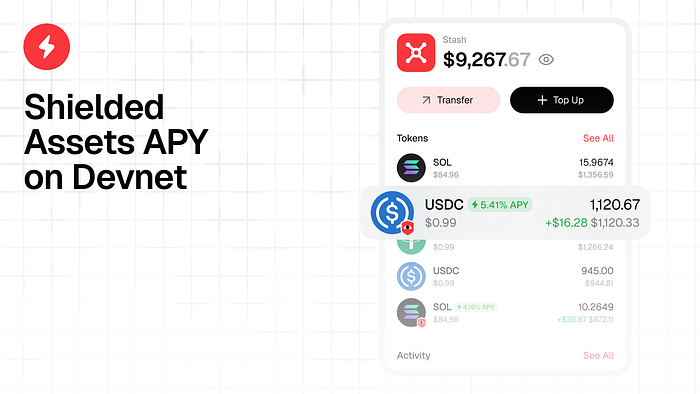
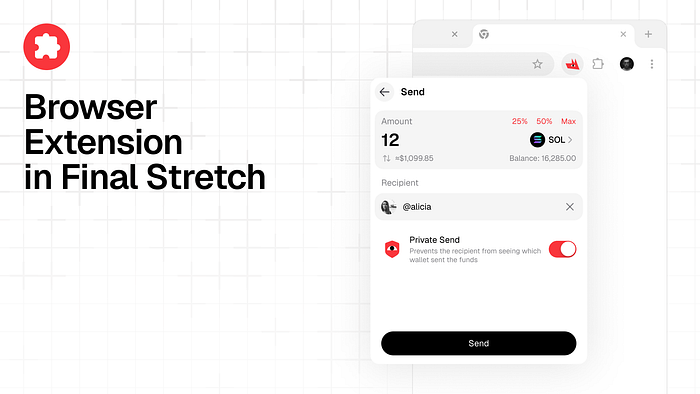
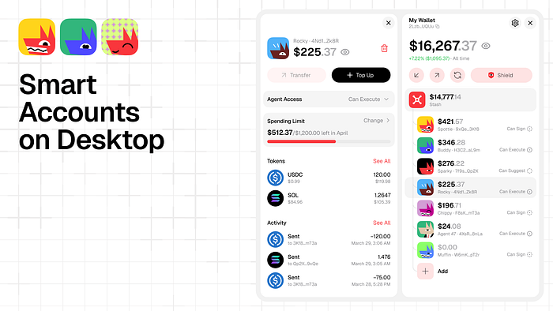

In some languages the @ symbol is called “the dog.” We did not know that when we decided every Smart Account should be represented by a dog. But it works out, because now when you tag your wallet in the chat, you are literally calling the dog. Hey @Spotty, swap this. Hey @Biscuit, rebalance that. The joke wrote itself.

Here is what we shipped this week and what is hitting mainnet next week.

## APY on Shielded Assets

Last week we shipped Shielded Assets to mainnet. Private transfers, live on Solana. This week we looked at the shielded balances sitting there and realized something obvious: idle money on-chain is wasted money. It is rare anywhere in DeFi to hold an asset that earns nothing. We did not want to be the exception.

So we are integrating Kamino. Spot APY on USDC, SOL, and USDT. It is on devnet right now, our developer is testing it. Mainnet goes live early next week. By Thursday or Friday you will be able to earn yield on your shielded assets directly from the frontend and the extension.

Privacy and yield. No reason you should have to pick one.

We also optimized the shielding and unshielding routes. Both now take a single transaction instead of multiple. Cheaper gas, faster execution. That matters more once your shielded assets are earning and you are moving in and out more frequently.

## The Browser Extension

Vlad demo’d the extension live on stream and it is the real thing. Side panel view in Chrome. You authorize with your wallet, your balance syncs, and you are in.

The important part: we are a general wallet provider now. Vlad connected to Jupiter during the stream to prove it. Tap connect, pick Loyal, done. Any dApp on Solana that supports wallet adapters can connect to us. We are on the same list as MetaMask and everyone else. That was the goal. Not a sidecar app. A wallet.

The extension ships to the Chrome Web Store next week. A couple of polish items left, import/export key management in settings, vault connection improvements. Then it is public. Everyone can download it.

## Smart Accounts and the Dogs

Smart Accounts are in closed testing on desktop. They ship publicly next week. Here is the idea.

You get two modes of agentic interaction. First mode: you add an agent to your Smart Account and it can suggest transactions. You review, you approve, it executes. This is the research pattern. Tell Claude or Codex to dig into a token, build the transaction, pass it to your wallet. You keep the final say. It is literally impossible for the agent to send money somewhere you did not approve. That unlocks every CLI tool and AI agent for Web3 without sacrificing custody.

Second mode is more autonomous. You set policies and spending limits per agent. The agent can rebalance your portfolio, optimize positions, operate within the permissions you defined. You do not even have to be there.

Now the dogs. Every Smart Account gets a unique identity generated from the hash of the wallet address. The first numbers in the hash determine the background color, the dog’s color, the dog’s emotion, and its name. A red background, angry dog, blue coat, named Spotty. Another wallet gets a calm green dog named Biscuit. You always know which account is which at a glance. Visual memory plus a name you can call from any text interface.

Our designer Alexander made the system and it is one of the most fun things we have shipped. Friendly, goofy, and nobody else does it this way.

## What is Next

Next week the extension goes public on Chrome. The week after that, we start on the mobile app. The architecture is similar to the extension so the timeline is tight. Goal is to have the mobile app submitted to the Solana Seeker dApp store within two weeks.

Once extension and mobile are live, you talk to the same stash from anywhere. Desktop, browser, phone. Suggest transactions, approve from whatever device you are on, never lose access, never compromise security. That is the setup we have been building toward.

Stay Loyal.

Website — [https://askloyal.com](https://askloyal.com/)

Docs — [https://docs.askloyal.com](https://docs.askloyal.com/)

Buy $LOYAL on Jupiter — [https://jup.ag/tokens/LYLikzBQtpa9ZgVrJsqYGQpR3cC1WMJrBHaXGrQmeta](https://jup.ag/tokens/LYLikzBQtpa9ZgVrJsqYGQpR3cC1WMJrBHaXGrQmeta)

Telegram Agent — [https://t.me/askloyal\_tgbot](https://t.me/askloyal_tgbot)

Telegram Community — [https://t.me/loyal\_tgchat](https://t.me/loyal_tgchat)

Discord — [https://discord.com/invite/tAwXsXwTv6](https://discord.com/invite/tAwXsXwTv6)

X (Twitter) — [https://x.com/loyal\_hq](https://x.com/loyal_hq)

GitHub — https://github.com/loyal-labs
