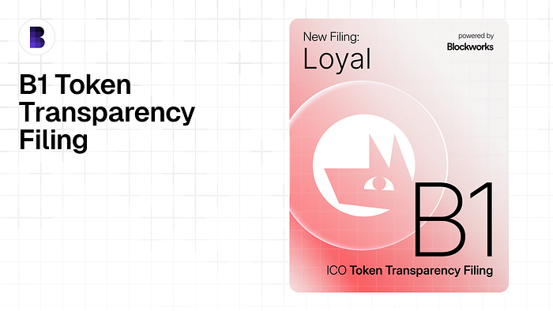
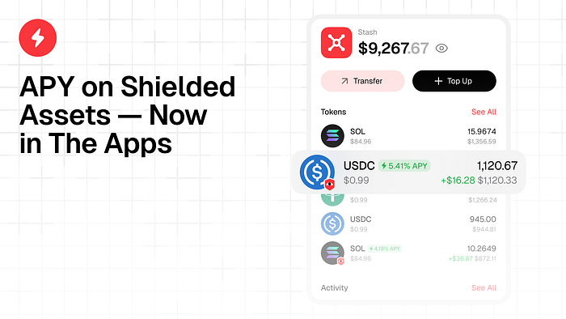
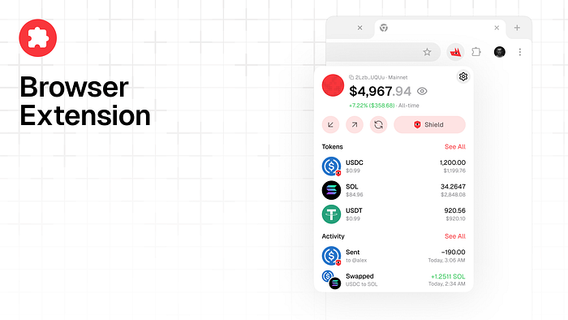

It was a good week. The kind where the work is there in front of you and it is real and it is done. We got our B1 token transparency filing live with Blockworks, pushed yield on shielded USDC toward mainnet across our apps, finished the browser extension for release, and kept reshaping the web experience so the product explains itself faster.

## The B1 filing is live

We are now live with our B1 token transparency filing through Blockworks. It took a few rounds, a few questions, and a few iterations, but it is done.

This matters because serious capital does not do diligence by vibes. People want a framework. They want a report. They want something they can point at without having to reverse-engineer a startup from tweets and Discord messages. That is what this filing gives us.

For Loyal, this is useful well beyond one announcement cycle. It helps with future exchange conversations, future fundraising, and the broader job of making an onchain company legible to institutions without turning it into something lifeless.

We are starting the B2 filing next. That one is more about smart contracts, advisors, and outside relationships. Different surface area. Same goal: make the structure clear.

## Yield on shielded USDC

We are finishing the shift to mainnet for shielded yield. The current setup is simple in the way good systems should be simple.

When you shield USDC with Loyal, the asset moves into the yield layer on mainnet while your private ownership lives on our private rollup. You still get the privacy model we are building toward, but now the dollars do not have to sit there doing nothing. They can keep working.

The yield target discussed on stream was roughly 4 to 8 percent. That range matters, but the bigger point is the direction: private assets should not become idle assets. Privacy should not mean opting out of utility.

This is one of the product ideas we care about most. Hide the user from the chain. Do not hide the capital from productive use.

## The browser extension is basically done

The browser extension is finished, polished, and lined up for release next week. It is already in the Chrome Web Store. Right now it is in the final internal testing phase before we open it up.

This is one of those releases that changes how the product feels. Loyal stops being a thing you visit and starts being a thing that is simply there, inside the browser, ready to connect wherever you are. Chris put it well on the stream: seeing your own extension in the browser list feels different.

The team demoed it across live sites and wallet flows. Connect, open, use it, move on. They also added a few small but important touches, like easier hover actions and direct token-price links out to Jupiter. Small interface details, but they reduce friction and make the product feel less fragile.

There was one moment of stream honesty too. Chris thought the extension might be generating a new key on reopen. Vlad immediately said it was not. That is the kind of detail we like seeing in public. Ship the thing, test it hard, catch the weirdness, verify it, move forward.

## The site is being rebuilt around conversion

We have also been reworking the landing experience. The main web app is moving toward its own subdomain, while the main site gets much better at doing the first job a product site has to do: explain what this thing is and why anyone should care.

The big design idea is straightforward. Remove clutter from the middle of the page. Put the core actions up front. Make it obvious where to go next, whether that is the web app, the extension, or mobile.

The new hero section will use animation to show real use cases instead of throwing abstract claims at visitors. Agent-guided finance is easier to understand when you can see the flow in a few seconds. Idle funds move into yield. Actions happen clearly. The value lands fast.

There is still some goofy Loyal energy in there too. Moving eyes. Cute loaders. A product that does not feel dead on arrival. We like serious infrastructure, but we do not think serious infrastructure has to look miserable.

## Next week

Next week the browser extension goes public. The new site keeps moving. And if one more release lands before the end of April, you will hear about it soon enough.

Stay Loyal.

Website: askloyal.com  
Docs: docs.askloyal.com  
Buy $LOYAL on Jupiter: jup.ag  
Telegram Agent: t.me/askloyal\_tgbot  
Telegram Community: t.me/loyal\_tgchat  
Discord: discord.com/invite/tAwXsXwTv6  
X (Twitter): x.com/loyal\_hq  
GitHub: github.com/loyal-labs
