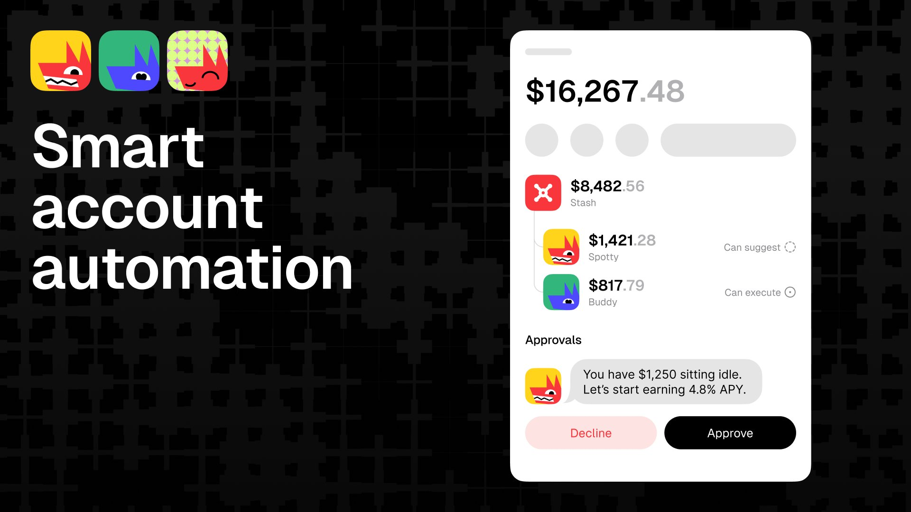

The Loyal app for Solana Seeker landed in the store, the first smart account automations went into testing, and the mascot finally has a name.

Tuesday is the official Seeker launch and the rest of the week was built around getting there.

## The Seeker App

The Loyal app is on Solana Seeker. The first build is already in the store, but you should wait for the launch version on Tuesday. The early one is dusty.

Most of what makes Loyal work on the extension and the mini app is now on Seeker. Shielded assets, swaps, sends, receives, the same approval flow. We added a few things specific to mobile. Backgrounds you can swap that conditionally restyle the top bar. Real-time balance and activity updates that propagate the moment a transaction lands. Push notifications when someone sends you money or any other action you care about hits the wallet. Over-the-air updates so we can ship a fix in five minutes without anyone redownloading anything. Vlad caught a small bug live on stream and patched it before the section was over.

Every token now has its own detail page: 24-hour chart, market data, holders, trust score, an about section pulled from CoinGecko. From the same page you can tap shield, swap, or send and the token is already loaded into the action. One less step every time.

The transaction approval screen got a serious upgrade. We now show every instruction in a transaction, every required permission, and the raw data if you want to inspect it. That came directly from users who told us the old version asked them to sign things they could not see. Fair complaint. Fixed.

The library is on Seeker too. Deep dives and FAQs with proper prev and next navigation, so you can read through a topic the way you would read a chapter.

## The Built-In Browser

Seeker ships with a full browser inside the app and a directory of 101 trusted Solana applications. You tap an app, connect Loyal, approve, and you are in. Jupiter works. The Loyal web app works. Anything you would expect to work, works.

## Smart Accounts and Agent Wallets

We started testing the first smart account automations this week. The first one is simple: if you have more than 100 USD un stablecoins sitting idle, the wallet will auto-shield them so they earn yield instead of doing nothing. That is the kind of behavior the wallet should have by default.

The bigger piece is the CLI integration we are finishing now. Once it ships, agents like Hermes and OpenClaw can be given a Loyal smart account with narrow authority over a specific set of actions. Your agent gets to act on your behalf without ever seeing your private key. That is structurally better than any custodial setup these agents currently use, which means it has a real shot at becoming the default. Smart accounts merge into the production app on Tuesday or Wednesday.

## Milo

The dog has a name. Milo. Calling it the dog or just Loyal was getting awkward. It is Milo now. The introduction goes out properly alongside the launch.

## The New Landing

The new landing site goes live next week. Same direction we previewed in week 16 — fewer slogans, more product, animated examples of what Loyal actually does. It pairs with the Seeker launch.

## Next Week

Tuesday, April 28, the Seeker app goes live. Two or three articles, three podcasts, and a launch video are lined up around it. Smart accounts ship to production midweek. Milo gets his proper introduction.

Stay Loyal.
