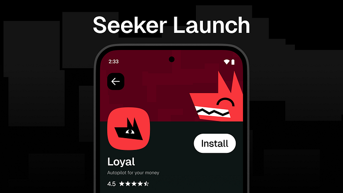
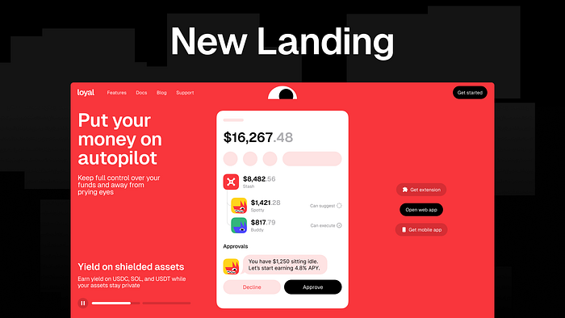
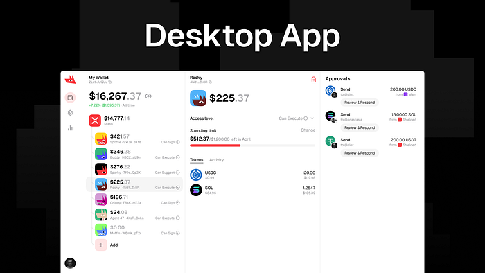

The Seeker launch is behind us, the new landing site is live, and the three-panel desktop app is days from production. We also got the thing we actually wanted out of the launch: an invitation into Seeker season. A short list this week, but the items on it are the ones that matter.

### The Seeker Launch

We launched on Solana Seeker. That alone is worth pausing on. Loyal in the official store, in the hands of Seeker holders, with the same shielded balances, swaps, sends, and approval flow we built across the other surfaces. The campaign around the launch was not the biggest Seeker has seen this year, but for the resources and connections we had going in, it landed.

The bigger payoff is what came next. The launch was strong enough to earn us a spot in Seeker season, which means more distribution, more eyes, and a longer runway with an audience that actually uses the wallet on a phone. The next two or three weeks decide how much ground we win out of that. We think it can be a lot.

### The New Landing

The new askloyal.com is live. It is bright, loud, and built to stay with you whether you are on it for two seconds or fifteen minutes.

The copy is not where we want it yet. We had a second pass written but did not get it in front of the test group in time, so it stayed on the bench for the week. The updated text ships next Friday with the rest of the polish. The shape and the feel were the parts we wanted to lock in first, and those landed.

### The Desktop Rebuild

The desktop app is moving from a sidebar layout to three panels. The old version pinned tokens to one side and put the input in the middle. It worked, but it does not scale to what the app actually needs to do — orchestrate a wallet, a multisig vault, and the wallets of any agents you have connected, all in the same view.

Three panels give us that. It also opens the door to more fluid interfaces, which matters once smart accounts and automations take more of the surface. The alpha pushed close enough to the Friday cutoff that we are holding it rather than shipping something rough. One more weekend of testing, and it goes to production around Monday.

### Smart Accounts Next

Smart accounts roll out everywhere next week, and the marketing cycle around them starts Wednesday. The work between now and then is the same three things: smart accounts have to behave, the automations have to behave, and the app has to make sense the first time a Seeker holder opens it. If we get that right, we can ride this into Seeker season instead of recovering from it.

### Next Week

Smart accounts ship. The desktop rebuild ships. The landing copy gets its second pass. Marketing for smart accounts kicks off Wednesday. Seeker season begins.

Stay Loyal.

Website — [https://askloyal.com](https://askloyal.com/)
  
Docs — [https://docs.askloyal.com](https://docs.askloyal.com/)
  
Buy $LOYAL on Jupiter — [https://jup.ag/tokens/LYLikzBQtpa9ZgVrJsqYGQpR3cC1WMJrBHaXGrQmeta](https://jup.ag/tokens/LYLikzBQtpa9ZgVrJsqYGQpR3cC1WMJrBHaXGrQmeta)
Telegram App — [https://t.me/askloyal\_tgbot](https://t.me/askloyal_tgbot)
  
Telegram Community — [https://t.me/loyal\_tgchat](https://t.me/loyal_tgchat)
  
Discord — [https://discord.com/invite/tAwXsXwTv6](https://discord.com/invite/tAwXsXwTv6)
  
X (Twitter) — [https://x.com/loyal\_hq](https://x.com/loyal_hq)
  
GitHub — https://github.com/loyal-labs
