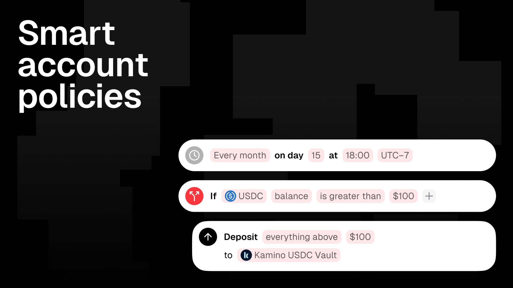

Lower fees on shielded balances are live, smart account policies are in the build, and the mobile app crossed enough reviews to give us real signal heading into the Google Play release.

Smaller week on the surface, but the pieces lining up behind it are the ones we have been waiting to ship.

## Lower fees on shielded balances

We rewrote the smart contracts behind shielding and the fees came down with them. Same flow, same privacy, less to pay every time you move money in and out. This one matters more than the line item suggests. Shielding has to be cheap enough that you stop thinking about it, otherwise people only do it on the way in and never on the way out. Cheaper fees push us closer to that.

## We are using our own wallet

Two weeks ago the team crossed a line we have been walking toward all year. We are now using Loyal as our daily wallet. Not the test build, not a sandbox account, the same app we ship to everyone else. The reason it stuck is the same thing we have been telling people for months: there is no other app where you do not have to pick between privacy and yield. Once that became true for us, the switch made itself.

Eating your own cooking is the only honest way to find what is broken. Expect the next few weeks of fixes to be sharper because of it.

## Smart account policies

The smart account policy layer is in build. The idea is the one we have been pointing at since smart accounts started: an on-chain guardrail you set once, that the wallet enforces forever. Spending limits, whitelisted contracts the agent is allowed to touch, and the rest of the controls you would want before you hand a key to anything that runs on its own.

The shape of the problem is what makes this worth doing. Today you either give an agent a private key and pray, or you stand up a separate policy server with something like Open Wallet and babysit it. Both are bad answers. Ours is a multisig with the rules written on chain, so the agent only spends what you let it spend, and there is no second server to keep alive. We showed an early UI on stream this week. It will change a few more times before it ships, but the pieces are real.

## Mobile, and the road to Google Play

The Seeker release has pulled in close to fifty reviews at a 4.2 average. That is the same rating Sanctum is sitting on, which is a useful checkpoint for an app that has been in real hands for a few weeks. More importantly, the reviews gave us a punch list. The next mobile cycle is polish driven by what people actually said, with a Google Play release behind it for the audience that does not have a Seeker.

## Next week

Smart accounts ship. Mobile gets the polish pass. Google Play prep continues. Fewer slides, more shipping.

Stay Loyal.
