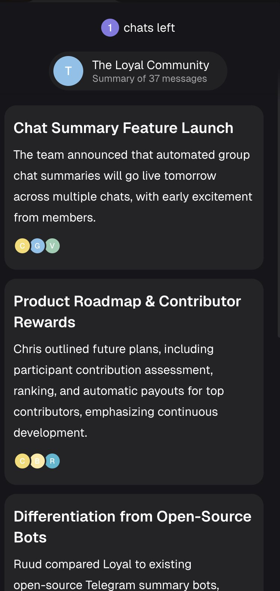

Here's what we shipped this week and where we're headed.

## A Smarter Way to Send

Telegram transactions now work from desktop, no Telegram app required.

The new send flow understands what you're doing as you type. You enter an amount, it immediately highlights it. It automatically picks up the difference between wallet address and Telegram username.

Just type naturally and the interface adapts!

Once sent, recipients get a claimable link. You can also refund the transaction if you accidentally sent it to the wrong person.

## Introducing Canvas

This is the big one.

We've been experimenting with a new interface concept: a free-form 3D canvas where you drag, drop, and combine elements like a crafting system.

Your tokens are objects. Actions (send, swap) are tools. Drop SOL onto "Send via Telegram" and the transaction flow opens. Drag two actions together and they form a group — like apps on your phone.

The idea: your dashboard should be yours. A community manager might pin salary payments, sentiment analysis, and group highlights. A liquidity provider might want LP positions, price charts, and personal messages. Same product, completely different workspace.

We're also building Recipes. Those are saved action templates you can execute with one click. Set up "Send 0.1 SOL to

[@candyflipline](https://x.com/candyflipline)

once, reuse it forever.

Still experimental. But this is where we're going.

## Group Chat Summaries Are Live

Open the Loyal mini-app and you'll see summaries of every chat where the bot is installed.

Right now it summarizes every 24 hours. Soon you'll be able to customize the frequency. We'll be adding profile pictures, notifications when new summaries drop next week. The end goal is to score active contributors to the community and create automatic incentive payouts to top10 of them.

Summaries will also become draggable Canvas elements, so you can pin the communities you care about most.

Check it out yourself!

## Q4 2025 Report + Buyback Complete

We published our first transparency report covering October 21 – December 31. Every expense, every major event — all public. Find it in our website footer or pinned on X.

The buyback also concluded: **1.5M USDC** spent to acquire **~6.35M tokens**, now sitting in the treasury alongside existing holdings. These tokens can only move via DAO proposal and are earmarked for future fundraising (OTC deals with funds/investors).

With most sellers cleared out, upward movement requires fewer buyers. The market is lighter now.

## What's Next

- Continued iteration on Canvas

- Simplified send/receive + desktop refunds via SDK

- Anti-spam feature testing

- Upgrading our default model to GPT open-source (120B parameters) for better response quality

- Private inference directly in the Telegram bot — no need to visit the website

- Team expansion (more soon)
