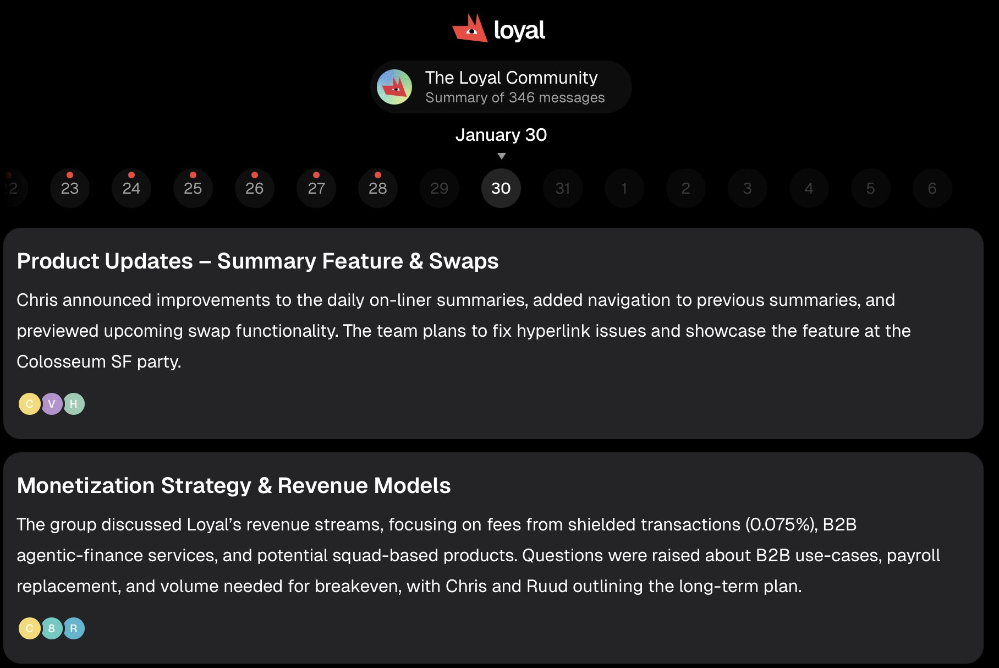
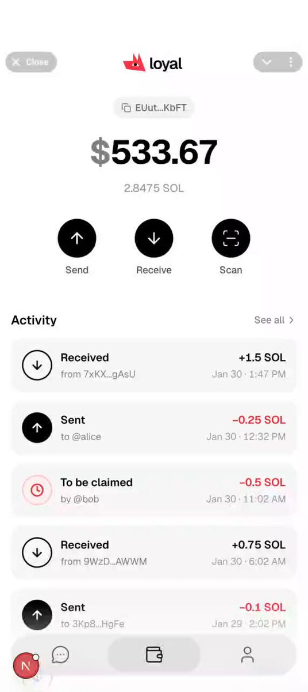

Infrastructure-heavy week! We migrated to a new database solution to speed up our feature velocity, introduced a brand-new light design concept to the mini app, laid the groundwork for private swaps and shielded assets.

## Community Chat Summaries — Now Live

Every 24 hours, our system generates a set of topics from everything discussed across your community chats. Those topics are served on the frontend for you to browse, and a brief digest message is posted directly in the group chat.

Sent daily and on command. An expanded summary is available in the mini app.

This is foundational work for branded agents, one of the paid features we see driving real revenue down the line.

The next iteration will let you deep dive into individual topics — seeing the main arguments, key quotes, charts, and conclusions from actual community discussions.

We want to think of it as a fundamentally new and easier way to stay on top of your communities.

Improved haptic feedback makes summaries feel genuinely physical to interact with

## Moving Past nilDB

This one was painful but necessary. The infrastructure we'd built on top of nilDB wasn't scaling the way we needed it to. The product was too raw and not feature-complete enough for production use. C'est la vie ¯\_(ツ)_/¯

We moved everything to new secure databases running in confidential mode with SOC2 compliance.

It took serious effort — we had to rework a significant amount of internal logic — but we didn't see no other choice if we wanted to keep our pace.

This migration tightened up our feedback loop, it's dramatically faster now. Every part of the pipeline is now built on established, battle-tested infrastructure. From here, the job is scaling each part individually, which is a much more tractable problem.

Since we had to migrate off nilDB, we had to re-write our encryption module to meet the future decentralization expectations of the users.

The goal was twofold: make it work seamlessly with the new infrastructure, and leave the door open for decentralizing the service as we grow.

The full pipeline — capture, process, encrypt, store incoming messages — is now complete and production-ready. This unblocks a wave of features that were waiting on secure message handling.

## Light Design Concept

The Loyal mascot blinks and twitches its ear. We're adding more expressions over time — the idea is that Loyal feels alive!

Vlad built a new light design concept in a single day, and honestly, it might be here to stay.

This isn't just a color-swapped dark theme. It's a different design direction entirely — minimalist, clean, and solid. No blur, no transparency. Every element feels intentional. In a sea of dark-mode-by-default crypto wallets (Phantom, Solflare, etc.), the light aesthetic stands out immediately.

## Swaps and Shielded Assets — What's Coming

We're building private ephemeral transfers over a private ephemeral rollup through MagicBlock. In plain terms: you'll be able to send assets to friends without publicizing the amount or the recipient.

Here's the roadmap:

- Swap support is expanding beyond native SOL to most available assets. The swap screen design is finalized and frontend implementation is underway.

- Regular swaps ship first. The design is ready, and token logic is being wired up on the backend now.

- Shielded swaps and transfers follow immediately after — built in close collaboration with the MagicBlock team.

Testing target: end of next week on Devnet. Mainnet target: end of the following week.

Going from Devnet implementation to Mainnet deployment within a week is aggressive. We're asking the community to help us test next week to make that timeline real.

## Plans for Next Week

- **Private message processing** — encryption pipeline is done, now wiring it into the product

- **Expanded summaries** — topic deep dives with main arguments and key quotes

- **Light design implementation** — rolling out across swaps and transfers

- **Desktop experience** — drag-and-drop swaps and consent flows

- **Telegram thread support** — the new Telegram bot threads feature lets you run multiple conversation threads with AskLoyal's TG bot, similar to how ChatGPT handles separate chats

- **Shielded asset testing** on Devnet — we'll need your help here

*We stream live every Friday. Follow us on*

[Twitter/X](https://x.com/loyal_hq)

*and join our*

[Telegram community](https://t.me/loyal_tgchat)

*to catch the next one.*
