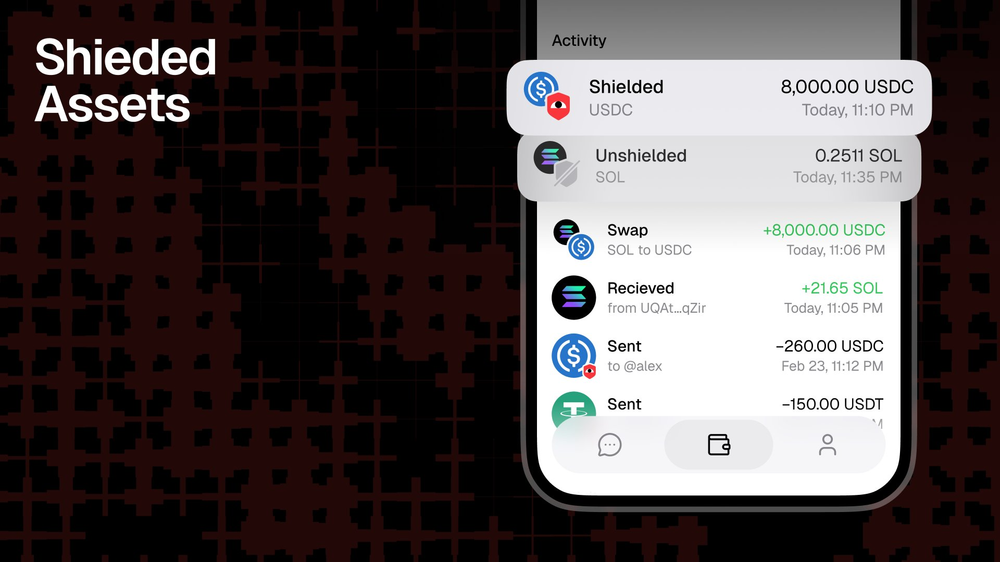
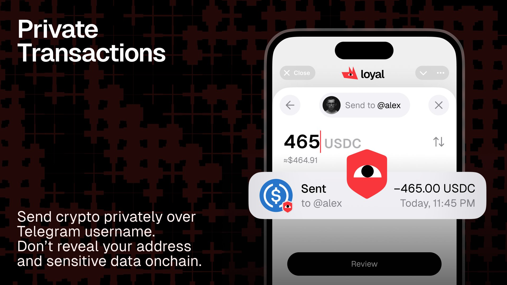
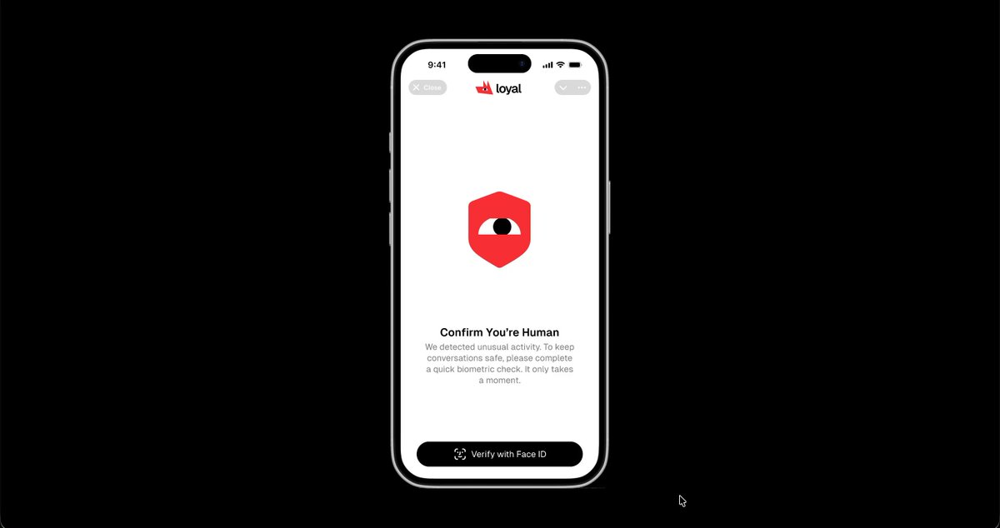
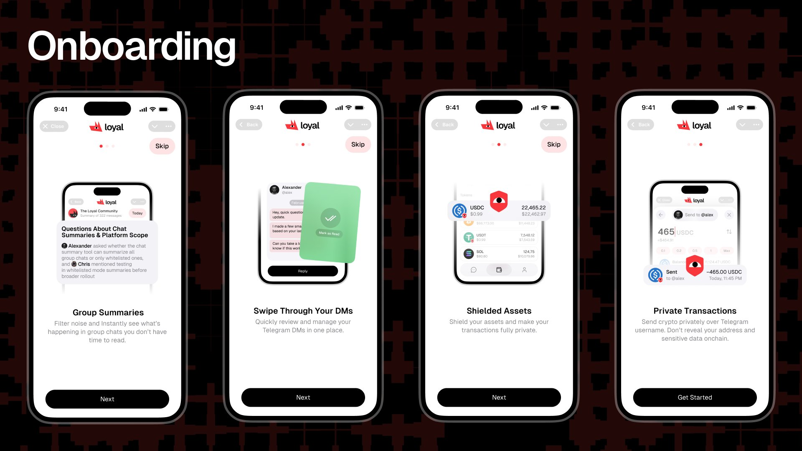

It was a good week. The kind where you sit down on Friday and the work is there in front of you and it is real and it is done.

Here is what we did.

---

We built a way to hold crypto so nobody can see it. You put coins in your Loyal wallet and they go dark. Nobody sees how much. Nobody sees what kind.

Sends are invisible too! You pay someone and the money moves and it arrives and there is no line on a ledger for the world to read. No one knows you sent it nor who got it.

The sends work on their own too. A bot can send. A script can send. An agent we build can send. The person on the other end opens Telegram and the money is waiting.

We built this because our agents will need to pay people. To run a community you need to pay the people who show up and do the work. Now that can happen without a person in the middle.

Both features are live on devnet today. We push them to mainnet next week.

## Summaries in Ten Groups

We expanded our testing community to 10 group chats. Rodion watches the numbers every day. Who opens the summaries. What time. Whether they come back the next day and the day after that.

You put a thing in front of people and you sit and watch and move one small piece and sit and watch again. There is no shortcut for this part.

But the thing underneath it is big. There are a lot of people who do this work in crypto. Community leads and BD people and DevRels and founders and marketing leads. They all live on Telegram. They wake up and there are hundreds of messages and they read for two hours before their real day starts. We want to hand them back that time. Two hours each morning for hundreds of thousands of people.

This is the slow work, but that is what we are after.

---

Next week we ship something new that I have been thinking about for a long time.

We built a way to check that you are a real person. Your phone looks at your face or reads your fingerprint. The data stays on your phone. We never see it. We never store it. We just get one word back: yes or no.

We are putting it in DMs first. You know what your DMs look like. Half of them are not from real people. We are going to fix that. Then we bring it to group chats. Then to whole communities.

I think about the people who manage communities for a living. The ones who spend their mornings deleting spam before their actual work starts. This is for them.

---

We shipped onboarding screens for new users. People told us the app was confusing on first launch. They were right.

## Next Week

We push private sends and quiet balances to the live network. We scale summaries past ten groups. We ship the human check to DMs.

See you next week.

*Stay Loyal.*
