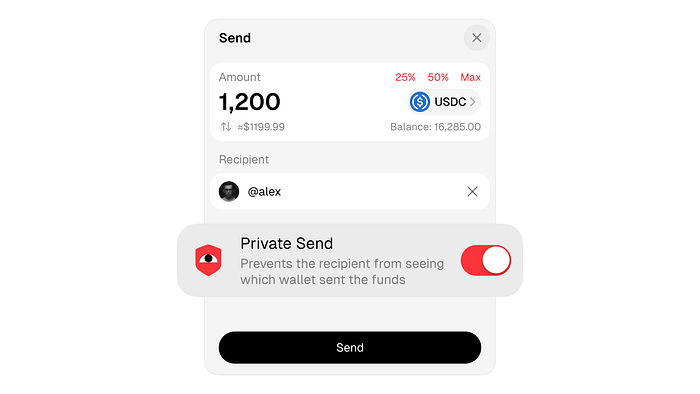
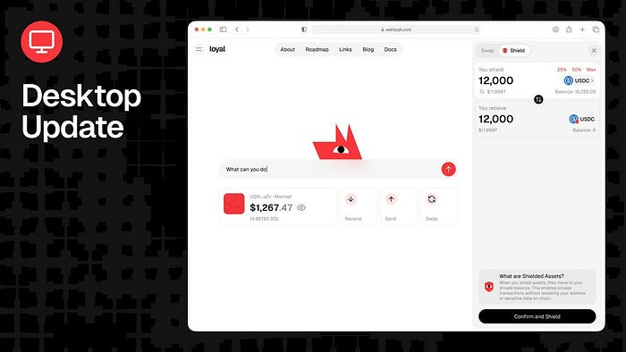
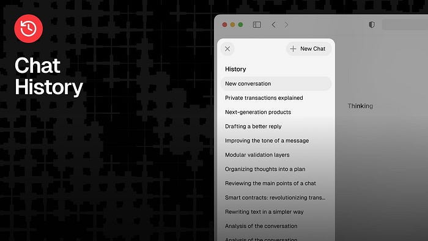

The best take from the stream: there is a pretty famous streamer who bought an expensive watch with USDT while traveling in Nigeria. The shop owner could look up his wallet. Every person who ever bought anything from that shop, anyone who knew the account, could look up his wallet. They could see exactly how much money he had.

Transparency is great until it is not.

## This week we shipped private transfers on mainnet.

Most people do not know what a seed phrase is. They have never touched a private key. They have a Binance account and they have been using it for years and they are not changing. We know these people. We have tried to pay them the other way.

Now we send to their Telegram handle and it becomes their problem in the best way. The money arrives. They figure it out. Nobody gets a lecture about Solana.

And the sender stays clean. No wallet address shared, no history exposed. The chain says nothing.

The fees are 02%. Ten times cheaper than the major wallets that added private transfers recently. No minimum amount. Send half a SOL if you want — Solflare won’t let you, we will.

## The desktop is unrecognizable.

Vlad has been building this for a while and this week it landed. Go to [askloyal.com](https://askloyal.com/)
 and you will feel the difference immediately. Full wallet integration. Everything the Telegram mini app does, the site does now. Private sends. Shield swaps. Portfolio view. Balance chart.

We added some eye-candy too: the dog follows your cursor when it is happy. It gets bored if you ignore it. It hides its eyes when you hide your balance. We are not going to say more than that. Go poke it. We are not responsible for what happens.

## Chat memory

Chat history is live now. Every wallet keeps its own conversation history. Connect a different wallet and you are in a different thread. The sidebar shows your wallet state while you chat so when the AI moves money, you see it, you approve it, you never leave the window.

The private LLM at [askloyal.com](https://askloyal.com/)
 now holds context reliably. We have been working on this for a while. Memory is stable now. and your history persists across sessions. The messages are stored in a secure database and encrypted with your wallet private key.

Next week we keep building. Stay loyal.

Website — [https://askloyal.com](https://askloyal.com/)
  
Docs — [https://docs.askloyal.com](https://docs.askloyal.com/)
  
Buy $LOYAL on Jupiter —  
[https://jup.ag/tokens/LYLikzBQtpa9ZgVrJsqYGQpR3cC1WMJrBHaXGrQmeta](https://jup.ag/tokens/LYLikzBQtpa9ZgVrJsqYGQpR3cC1WMJrBHaXGrQmeta)
  
Telegram Agent — [https://t.me/askloyal\_tgbot](https://t.me/askloyal_tgbot)
  
Telegram Community — [https://t.me/loyal\_tgchat](https://t.me/loyal_tgchat)
  
Discord — [https://discord.com/invite/tAwXsXwTv6](https://discord.com/invite/tAwXsXwTv6)
  
X (Twitter) — [https://x.com/loyal\_hq](https://x.com/loyal_hq)
  
GitHub — [https://github.com/loyal-labs](https://github.com/loyal-labs)
